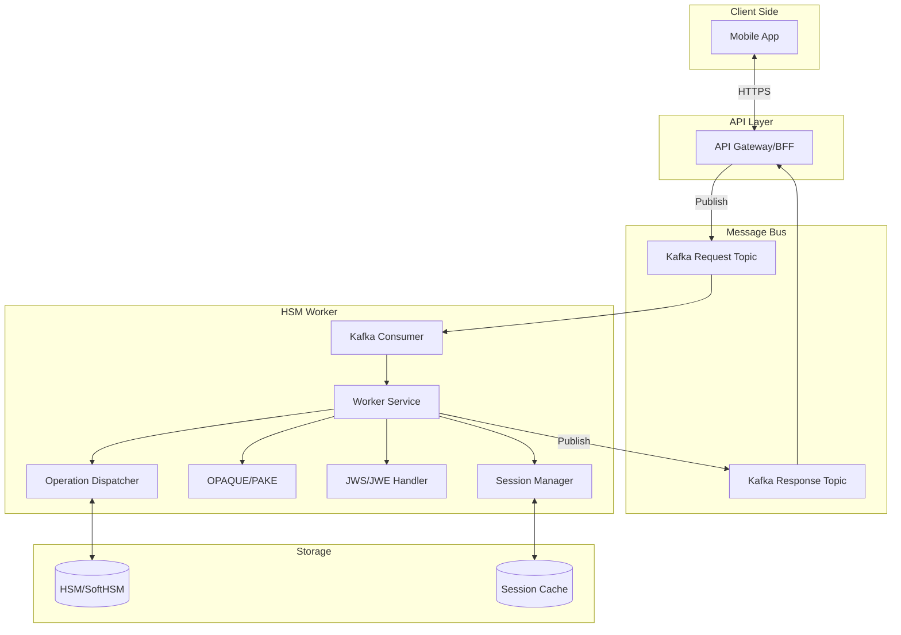
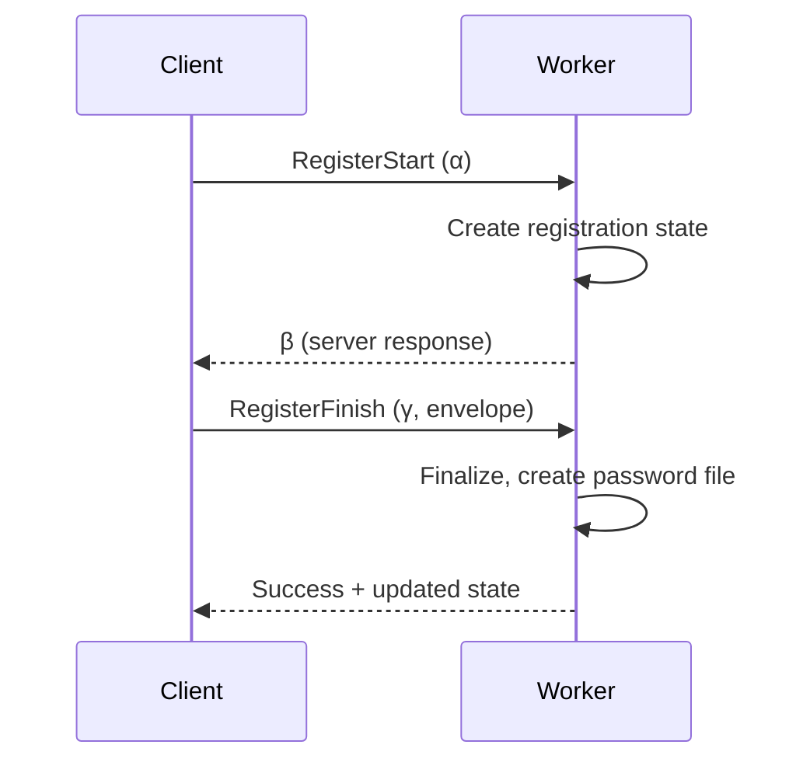
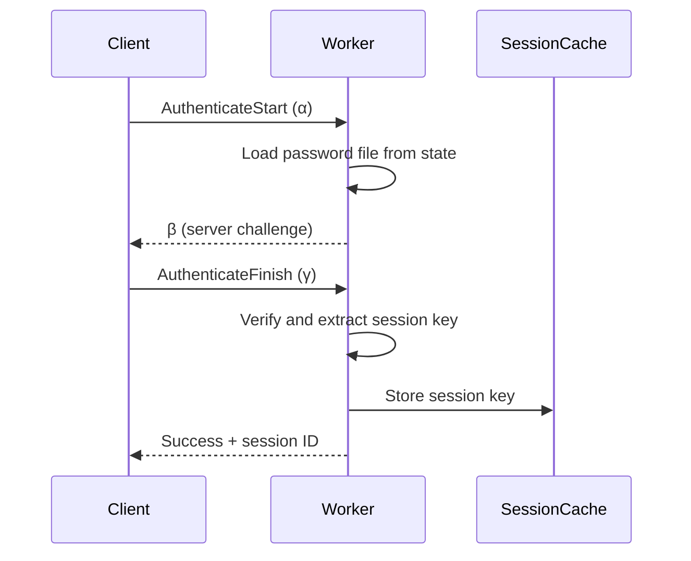
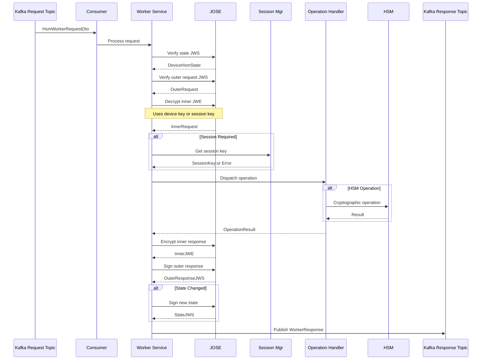
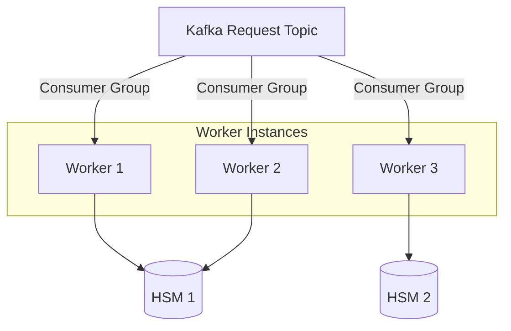

# Architecture Overview

This document describes the HSM Worker's architecture, components, and integration points.

## System Context



## Components

### 1. Kafka Integration

The worker is a message-driven service that communicates via Apache Kafka.

**Request Topic**
- Consumes `HsmWorkerRequestDto` messages
- Each message contains:
  - `requestId`: Correlation ID
  - `stateJws`: Signed device state
  - `outerRequestJws`: Signed request envelope

**Response Topic**
- Publishes `WorkerResponse` messages
- Each response contains:
  - `requestId`: Matches original request
  - `httpStatus`: Suggested HTTP status code
  - `stateJws`: Updated device state (if changed)
  - `serviceResponseJws`: Signed response envelope

**Consumer Groups**
- Worker instances form a consumer group for horizontal scaling
- Each request is processed by exactly one worker instance
- No shared state between workers (stateless processing)

### 2. Worker Service

The core orchestrator that:
1. Validates incoming requests
2. Verifies JWS signatures
3. Decrypts JWE payloads
4. Dispatches to operation handlers
5. Encrypts and signs responses
6. Publishes results to Kafka

**Key Responsibilities:**
- Request validation and deserialization
- JWS/JWE cryptographic operations
- State management
- Error handling and response formatting

### 3. JOSE (JWS/JWE) Handler

Manages all JSON Object Signing and Encryption operations:

**JWS Operations:**
- Verify device signatures on `OuterRequest`
- Sign `OuterResponse` and `DeviceHsmState` with worker's key
- Key management for worker signing key

**JWE Operations:**
- Decrypt `InnerRequest` using device key (ECDH-ES) or session key (dir + AES-GCM)
- Encrypt `InnerResponse` using appropriate key based on operation type

**Key Storage:**
- Worker signing key stored as JWK (configured via env)
- Device public keys embedded in `DeviceHsmState`
- Session keys stored in session cache

### 4. Operation Dispatcher

Routes requests to specific operation handlers based on `operationId`:

```rust
match operation_id {
    AuthenticateStart => authenticate_start_op.execute(context),
    AuthenticateFinish => authenticate_finish_op.execute(context),
    RegisterStart => register_start_op.execute(context),
    RegisterFinish => register_finish_op.execute(context),
    HsmSign => hsm_sign_op.execute(context),
    HsmGenerateKey => hsm_keygen_op.execute(context),
    HsmDeleteKey => hsm_delete_key_op.execute(context),
    HsmListKeys => hsm_list_keys_op.execute(context),
    EndSession => session_end_op.execute(context),
    // ... other operations
}
```

**Operation Context:**
Each handler receives:
- `requestId`: Correlation ID
- `state`: Current device state
- `outerRequest`: Verified outer envelope
- `innerRequest`: Decrypted inner payload
- `sessionId`: Current session (if exists)
- `deviceKid`: Device key ID from JWS header

**Operation Result:**
Each handler returns:
- Updated `state` (optional, if state changed)
- Response `data`: Operation-specific response
- `sessionId`: New or existing session ID

### 5. OPAQUE/PAKE Authentication

Implements the OPAQUE password-authenticated key exchange protocol:

**Components:**
- Server setup (initialized from config)
- Server identifier (stable domain identifier)
- Context string (protocol context)

**Registration Flow:**


**Authentication Flow:**


**Security Properties:**
- Server never sees the password
- Password file can only be used with correct password
- Mutual authentication (client proves knowledge, server proves identity)
- Establishes shared session key

### 6. Session Manager

Manages active sessions after successful authentication:

**Session Storage:**
- In-memory cache (Moka cache with TTL)
- Key: `SessionId` (UUID)
- Value: `SessionKey` (AES-256 key derived from OPAQUE)

**Session Lifecycle:**
1. **Created**: After successful `AuthenticateFinish`
2. **Active**: Used for encrypting/decrypting session-mode operations
3. **Expired**: Automatically removed after TTL (configurable)
4. **Ended**: Explicitly removed by `EndSession` operation

**TTL Management:**
- Default TTL: 300 seconds (5 minutes)
- TTL returned in `AuthenticateFinish` response
- Client must track expiration and re-authenticate

**Session Validation:**
For operations requiring session:
```rust
fn validate_session(&self, session_id: &SessionId) -> Result<SessionKey> {
    self.session_cache
        .get(session_id)
        .ok_or(ServiceRequestError::UnknownSession)
}
```

### 7. HSM Integration

Interfaces with PKCS#11 HSM for cryptographic operations:

**Development:** SoftHSM (software implementation)
**Production:** Hardware HSM (e.g., Thales, Utimaco)

**HSM Operations:**
- **Key Generation**: Generate EC keypairs (P-256, P-384, P-521)
- **Signing**: ECDSA signatures (SHA-256)
- **Key Agreement**: ECDH shared secret derivation
- **Key Management**: List, delete keys

**Key Storage Model:**
```
HSM Token: "hsm-worker"
├─ Unwrap Key (AES, label: "aes-unwrap-key")
│   Used for: Protecting device keys
│
└─ Device Keys (EC, labels: "device:<device_id>:key:<key_id>")
    ├─ device:abc123:key:signing-key-1 (P-256)
    ├─ device:abc123:key:encryption-key (P-384)
    └─ device:def456:key:signing-key-1 (P-256)
```

**PKCS#11 Integration:**
```rust
// Find key in HSM
let key = hsm.find_key(token_label, key_label)?;

// Sign data
let signature = hsm.sign(
    key,
    Mechanism::Ecdsa,
    data
)?;
```

**Key Metadata in State:**
Device state tracks public keys and metadata:
```json
{
  "hsmKeys": {
    "signing-key-1": {
      "curve": "P-256",
      "publicKey": {
        "kty": "EC",
        "crv": "P-256",
        "x": "...",
        "y": "..."
      }
    }
  }
}
```

## Data Flow

### Complete Request Processing



## Configuration

### Environment Variables

**Kafka Configuration:**
```bash
KAFKA_BROKERS=localhost:9092
KAFKA_REQUEST_TOPIC=r2ps-hsm-requests
KAFKA_RESPONSE_TOPIC=r2ps-hsm-responses
KAFKA_GROUP_ID=r2ps-worker-group
```

**OPAQUE Configuration:**
```bash
OPAQUE_SERVER_SETUP=<base64-encoded-server-setup>
OPAQUE_SERVER_IDENTIFIER=signing.example.com
OPAQUE_CONTEXT=RemoteSigning-v1
```

**HSM Configuration:**
```bash
SOFTHSM2_CONF=/path/to/softhsm2.conf
PKCS11_TOKEN_LABEL=hsm-worker
PKCS11_PIN=1234
```

**Worker Keys:**
```bash
SERVER_OPAQUE_KEY=<path-to-jwk>  # Worker's signing key
```

### SoftHSM Setup (Development)

1. **Initialize token:**
```bash
softhsm2-util --init-token --slot 0 --label "hsm-worker"
```

2. **Create unwrap key:**
```bash
# Automatically created on first run by the worker
# or manually:
pkcs11-tool --module /usr/lib/softhsm/libsofthsm2.so \
  --login --pin 1234 \
  --keygen --key-type AES:32 \
  --label aes-unwrap-key
```

3. **Configure path:**
```conf
# softhsm2.conf
directories.tokendir = /path/to/tokens/
objectstore.backend = file
```

## Scalability

### Horizontal Scaling

Multiple worker instances can run concurrently:



**Considerations:**
- Workers share Kafka consumer group (each message to one worker)
- Session cache is per-worker (session affinity not required, but re-auth may be needed)
- HSM can be shared (PKCS#11 supports concurrent access)
- State is in request (no database needed)

### Performance

**Bottlenecks:**
1. HSM operations (signing, key generation)
2. JWE encryption/decryption (ECDH key agreement)
3. Kafka throughput

**Optimizations:**
- Connection pooling for Kafka producers
- HSM session reuse
- Session cache (Moka) for fast lookup
- Async Kafka consumers (future enhancement)

## Deployment

### Docker Container

```dockerfile
FROM rust:1.75 as builder
WORKDIR /app
COPY . .
RUN cargo build --release

FROM debian:bookworm-slim
RUN apt-get update && apt-get install -y \
    softhsm2 \
    libssl3 \
    ca-certificates
COPY --from=builder /app/target/release/rust-r2ps-worker /usr/local/bin/
CMD ["rust-r2ps-worker"]
```

### Production HSM

For production deployment:
1. Replace SoftHSM with hardware HSM
2. Update `PKCS11_MODULE_PATH` to HSM library
3. Configure HSM network access (if network HSM)
4. Set up HSM backup and disaster recovery
5. Implement key ceremony for unwrap key generation

## Monitoring

**Key Metrics:**
- Kafka lag (consumer behind)
- Request processing time
- HSM operation latency
- Session cache hit/miss ratio
- Error rates by operation type

**Logging:**
- Structured JSON logs (tracing-subscriber)
- Request ID correlation
- Error details with stack traces
- HSM operation tracking

**Health Checks:**
- Kafka connectivity
- HSM availability
- Session cache status
