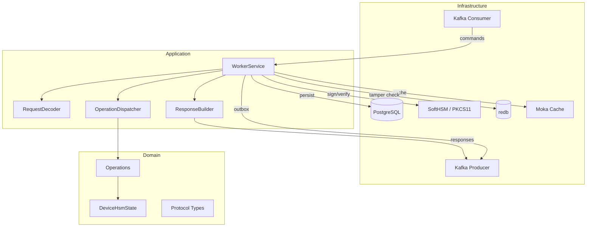

# Architecture Overview

The HSM Worker follows a hexagonal (ports-and-adapters) architecture with three layers: domain, application, and infrastructure.

## Layers

### Domain

Pure data types with no infrastructure dependencies. Contains the device state aggregate (`DeviceHsmState`), protocol envelope types (requests, responses, JWS/JWE wrappers), operation identifiers, and error types.

### Application

Business logic orchestration. Defines **port traits** (interfaces) for all external dependencies, and contains the **WorkerService** orchestrator, **RequestDecoder** (JWS verification + JWE decryption), **ResponseBuilder** (JWE encryption + JWS signing), and the **OperationDispatcher** which routes each request to the correct operation handler.

### Infrastructure

Concrete implementations of all ports:

| Adapter | Port | Technology |
|---------|------|------------|
| Kafka Consumer | Incoming (drives WorkerService) | rdkafka |
| Snapshot Consumer | Incoming (populates caches) | rdkafka |
| JoseAdapter | JosePort | JOSE library (ES256, ECDH-ES) |
| OpaquePakeAdapter | PakePort | opaque-ke crate |
| HsmWrapper | HsmSpiPort | cryptoki / PKCS#11 |
| PostgresStateRepository | StateRepository | postgres crate |
| KafkaResponsePublisher | ResponsePublisher | rdkafka |
| MokaStateCache | StateCache | moka (in-memory) |
| RedbTamperCache | TamperDetectionCache | redb (on-disk) |
| SessionKeyMemoryCache | SessionKeySpiPort | In-memory with TTL |
| OutboxRelay | Standalone | postgres + rdkafka |

## Ports

### Incoming (driving)

A single use case interface defines the entry point:

- `execute(HsmWorkerRequest)` -- for standard commands (authenticate, register, HSM operations)
- `execute_state_init(StateInitCommandDto)` -- for device initialization

### Outgoing (driven)

| Port | Purpose |
|------|---------|
| **JosePort** | JWS signing/verification, JWE encryption/decryption |
| **PakePort** | OPAQUE registration and authentication |
| **HsmSpiPort** | PKCS#11 key generation and ECDSA signing |
| **SessionKeySpiPort** | Session key storage with TTL |
| **StateRepository** | PostgreSQL state persistence with transactional outbox |
| **StateCache** | In-memory state cache for read-only operations |
| **TamperDetectionCache** | On-disk version witness for rollback detection |
| **ResponsePublisher** | Direct Kafka publish for read-only and error responses |
