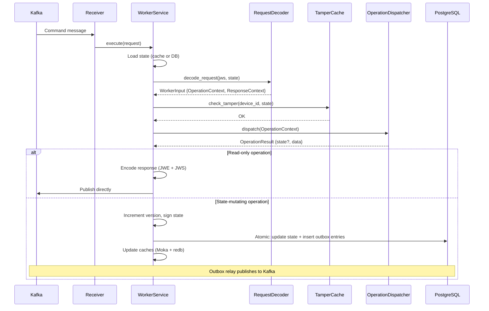
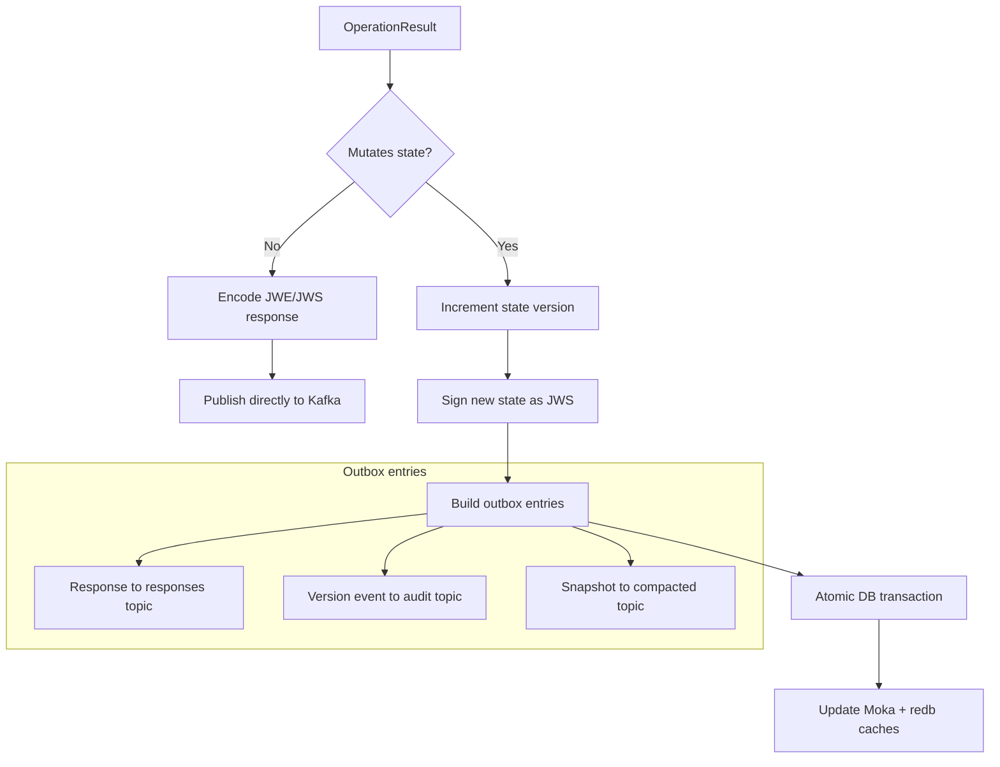

# Request Processing Pipeline

Every command follows the same pipeline through the worker. The path diverges at the persist step depending on whether the operation mutates state.

## Standard command flow

## Pipeline steps

### 1. Load state

The worker first attempts to load the device state from the in-memory Moka cache. On a cache miss, it falls back to PostgreSQL, verifies the state JWS signature, and populates the cache.

### 2. Decode request

The `RequestDecoder` processes the two-layer envelope:

1. **Outer JWS**: Verified using the device's public key (extracted from the loaded state). This confirms the request came from the registered device.
2. **Inner JWE**: Decrypted using either the session key (for authenticated operations) or the server's private key via ECDH-ES (for unauthenticated operations). The inner payload contains the `OperationId` and operation-specific data.

### 3. Tamper check

For state-mutating operations, the loaded state version is compared against the redb tamper detection cache. If the database version is lower than the cached version, it indicates a rollback attack and the request is rejected.

### 4. Dispatch operation

The `OperationDispatcher` routes the request to the appropriate `ServiceOperation` implementation based on the `OperationId`. The operation receives the full `OperationContext` (state, decoded request, session info) and returns an `OperationResult`.

### 5. Persist and respond

The path splits based on whether the operation mutates state:

**Read-only path**: The response is encoded (JWE encrypted, JWS signed) and published directly to Kafka via the `ResponsePublisher`.

**Mutating path**: The new state version is incremented, signed as a JWS, and persisted atomically with three outbox entries in a single PostgreSQL transaction:

| Outbox entry | Kafka topic | Purpose |
|-------------|-------------|---------|
| Worker response | `responses` | Delivered to the requesting client via the BFF |
| State version event | `state-versions` | Audit trail |
| State snapshot | `state-snapshot` | Log-compacted topic for cache warm-up on restart |

After the transaction commits, the in-memory (Moka) and on-disk (redb) caches are updated.

## State initialization flow

State initialization follows a separate entry path. The BFF sends a `StateInitCommandDto` (plaintext, no JWS envelope) containing the device's public key. The worker creates a synthetic operation context, runs the `StateInit` operation to generate version 0 state with the device key, builds a proper JWS/JWE response, and persists via the same transactional outbox mechanism.

The response is encrypted with the device's public key using ECDH-ES and contains the `device_id` and `dev_authorization_code` needed for PIN registration.
