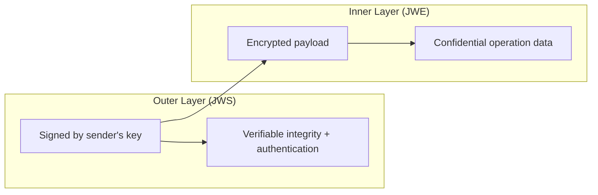
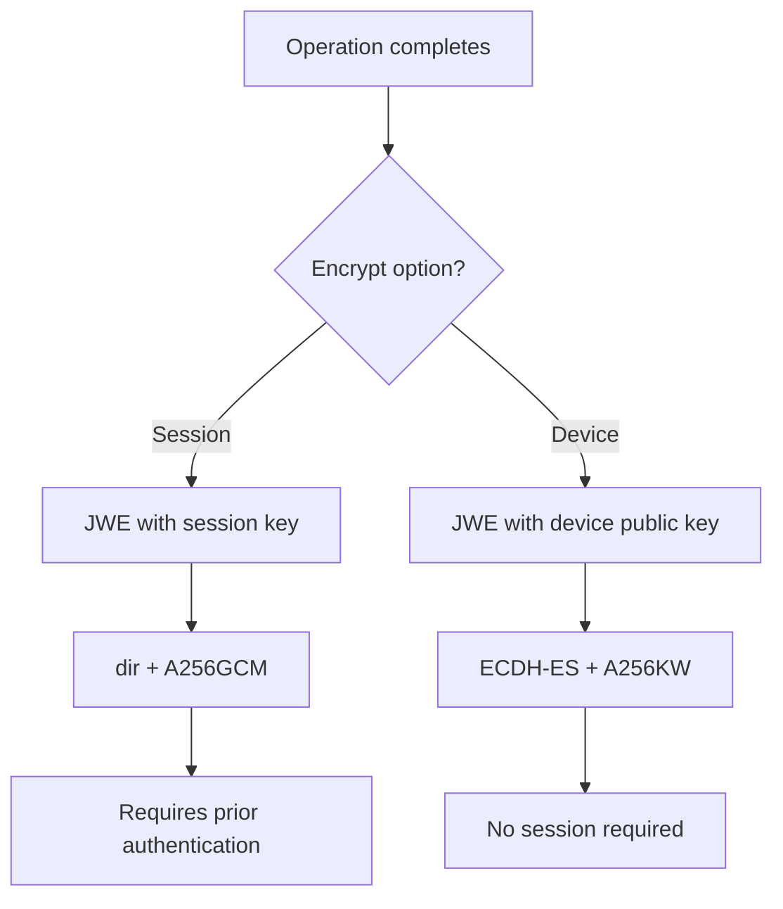

# Security Model

The HSM Worker implements defense-in-depth with multiple layers of cryptographic protection.

## JWS/JWE envelope nesting

All requests and responses use a two-layer envelope:



### Request envelope

| Layer | Format | Key | Purpose |
|-------|--------|-----|---------|
| Outer | JWS (ES256) | Device's EC private key | Proves the request originated from the registered device |
| Inner | JWE (ECDH-ES+A256KW / dir+A256GCM) | Session key or device key | Protects the operation payload |

### Response envelope

| Layer | Format | Key | Purpose |
|-------|--------|-----|---------|
| Outer | JWS (ES256) | Server's EC private key | Proves the response originated from the worker |
| Inner | JWE (ECDH-ES+A256KW / dir+A256GCM) | Session key or device key | Protects the response payload |

## Encryption options

Each operation type defines whether its response is encrypted with the **session key** or the **device's public key**:



- **Session encryption**: Used for operations within an authenticated session (HSM operations, PIN change). The session key is derived during OPAQUE authentication and stored in the worker's session cache with a TTL.
- **Device encryption**: Used for operations before a session exists (state-init, registration, initial authentication). The JWE is encrypted with ECDH-ES using the device's EC public key.

## OPAQUE PAKE authentication

PIN-based authentication uses the OPAQUE protocol, a password-authenticated key exchange that:

- Never sends the PIN over the network (not even as a hash)
- Is resistant to offline dictionary attacks
- Derives a shared session key on successful authentication

The OPAQUE server state (password files) is stored within the `DeviceHsmState`, so the HSM Worker acts as the OPAQUE server.

## HSM key protection

HSM-managed keys use a two-tier protection model:

1. **PKCS#11 key generation**: Private keys are generated inside the HSM and never leave it in plaintext.
2. **Key wrapping**: Private keys are wrapped (encrypted) by an AES wrap key held in the HSM. The wrapped key blob is stored in `DeviceHsmState` alongside the public key. Signing operations unwrap the key inside the HSM, sign, and return only the signature.

In development, SoftHSM provides a software PKCS#11 implementation. In production, a hardware HSM provides the same interface with stronger isolation.

## Tamper detection

The on-disk redb cache acts as a monotonic version witness. On every state load for a mutating operation, the worker compares:

```
if loaded_state.version < redb_cached_version:
    reject with TamperDetected
```

This detects database rollback attacks where an attacker replaces the current state with an older version. The redb cache file is local to the worker process and not accessible via the database.

## State integrity

Each state version is JWS-signed by the server's private key. When loading state from the database, the signature is verified before use. This prevents undetected modification of state data in PostgreSQL.
