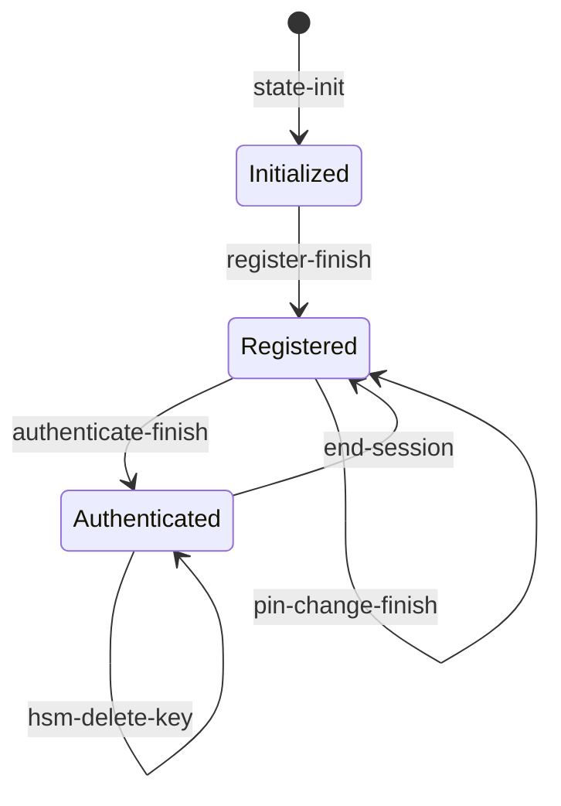
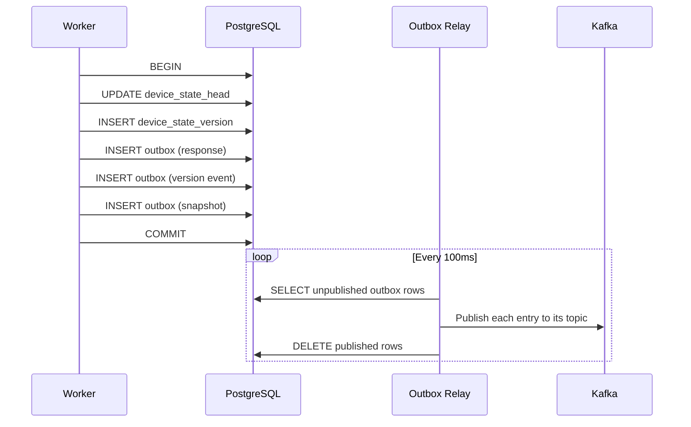
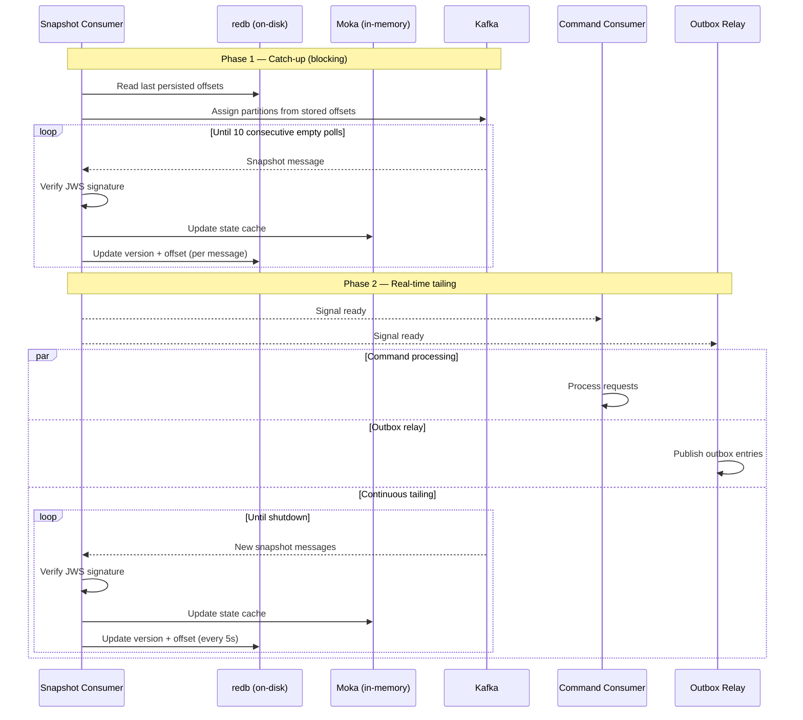

# State Management

Device state is server-owned and persisted in PostgreSQL. The worker is the sole writer; clients never see or hold raw state.

## Device state lifecycle



## DeviceHsmState

The root aggregate contains:

| Field | Type | Description |
|-------|------|-------------|
| `version` | `u64` | Monotonic counter, incremented on each state-mutating operation. Version 0 is the genesis state created by state-init. |
| `device_keys` | `Vec<DeviceKeyEntry>` | Registered device keys, each with an EC public key, optional OPAQUE password files, and an authorization code. |
| `hsm_keys` | `Vec<HsmKey>` | HSM-managed keys, each with a wrapped private key (encrypted by the HSM wrap key), the corresponding EC public key in JWK format, and a creation timestamp. |

State is serialized as JSON, signed as a JWS by the server's private key, and stored in the `device_state_version` table.

## Database schema

```
device_state_head          device_state_version
+-----------+--------+     +-----------+---------+-----------+--------------+----------------+
| device_id | version|     | device_id | version | state_jws | command_type | correlation_id |
+-----------+--------+     +-----------+---------+-----------+--------------+----------------+
| PK        | current|     | PK (composite)      | signed    | audit        | traceability   |
+-----------+--------+     +-----------+---------+-----------+--------------+----------------+
```

- **`device_state_head`**: One row per device, tracks the current version. Used for optimistic concurrency control (`SELECT ... FOR UPDATE`).
- **`device_state_version`**: Append-only log of all state versions. Each row contains the JWS-signed state, the command that produced it, and the correlation ID for traceability.

## Optimistic concurrency

State mutations use optimistic concurrency via the `expected_version` parameter:

1. Load current state (version N)
2. Process operation, produce new state
3. Attempt to persist with `expected_version = N`, `new_version = N + 1`
4. If another write incremented the version in between, the transaction fails with `ConcurrencyConflict`

For state-init (version 0), `expected_version` is `None` and the persistence layer uses `INSERT ... ON CONFLICT DO NOTHING` to detect duplicate initialization.

## Transactional outbox

All state mutations are persisted atomically with outbox entries in a single PostgreSQL transaction. This guarantees that if the state is updated, the corresponding Kafka events will eventually be published.



## Caching

Two caches accelerate state access and provide tamper detection:

### Moka (in-memory)

An LRU cache holding deserialized `DeviceHsmState` objects. Avoids repeated PostgreSQL queries and JWS verification for frequently accessed devices. Populated on cache miss from the database, and updated after each successful state mutation.

### redb (on-disk tamper detection)

A persistent key-value store mapping `device_id` to the last known `version`. Acts as a monotonic version witness: if a loaded state has a version lower than what redb has seen, a rollback attack is detected and the request is rejected with `TamperDetected`.

The redb cache is populated from the log-compacted `state-snapshot` Kafka topic (see below), ensuring tamper detection survives worker restarts.

## State-snapshot consumer

The `state-snapshot` Kafka topic is a log-compacted topic keyed by `device_id`. Every state-mutating command produces a snapshot entry (via the transactional outbox) containing the `device_id`, `state_jws`, and `version`. This topic is the backbone of cross-worker tamper detection and state cache warming.

### No consumer group — every worker sees every message

The snapshot consumer deliberately does **not** use a Kafka consumer group. Instead it uses manual partition assignment (`consumer.assign()`). This means every worker instance independently reads **all** partitions and **all** messages — there is no load-balancing across workers.

This design is intentional: every worker needs a **complete** view of all device versions for tamper detection to be effective. A shared consumer group would partition messages across workers, leaving each with an incomplete picture and allowing rollback attacks to go undetected.

Offsets are tracked per-partition in the local redb database (table `snapshot_offsets`), not in Kafka's consumer group offset storage.

### Kafka consumer configuration

| Property | Value | Notes |
|----------|-------|-------|
| `bootstrap.servers` | From config | Shared with all Kafka clients |
| `enable.auto.commit` | `false` | Offsets managed manually in redb |
| `auto.offset.reset` | `earliest` | Reads from beginning if no redb offset exists |
| `fetch.wait.max.ms` | `50` | Low-latency polling |
| `group.id` | **Not set** | No consumer group; manual partition assignment |

### Two-phase consumption

The consumer operates in two sequential phases:



**Phase 1 — Catch-up (startup, blocking):**
Reads from the last persisted redb offset forward, processing all available messages until 10 consecutive empty polls indicate the consumer has caught up. Offsets are persisted to redb after every message for crash safety. The command consumer and outbox relay threads are **blocked** until this phase completes — the worker does not accept requests until the tamper cache is fully warmed.

**Phase 2 — Real-time tailing (continuous):**
After signaling readiness, the consumer enters an indefinite loop tailing the topic for new snapshot messages published by **other** worker instances (via the outbox relay). This keeps every worker's tamper and state caches current with the entire cluster, not just its own writes. Offsets are persisted to redb every 5 seconds in this phase (rather than per-message) to reduce write amplification.

### Message processing

Each consumed snapshot message is processed by:

1. **JWS verification** — the signed state is verified against the server's public key.
2. **Moka cache update** — the deserialized `DeviceHsmState` is inserted into the in-memory cache, avoiding future database lookups.
3. **redb version update** — the device's version is written to the tamper cache. Since redb only moves forward (monotonic witness), this establishes the high-water mark used for rollback detection.

### Bootstrap utility

The CLI provides a `bootstrap-snapshot` subcommand that reads all current device states from PostgreSQL and publishes them to the `state-snapshot` topic. This is used to rebuild the topic from the database after topic deletion or during initial cluster setup:

```
hsm-worker bootstrap-snapshot [--device-id <ID>]
```

Without `--device-id`, all devices are bootstrapped. With it, only the specified device is published.
