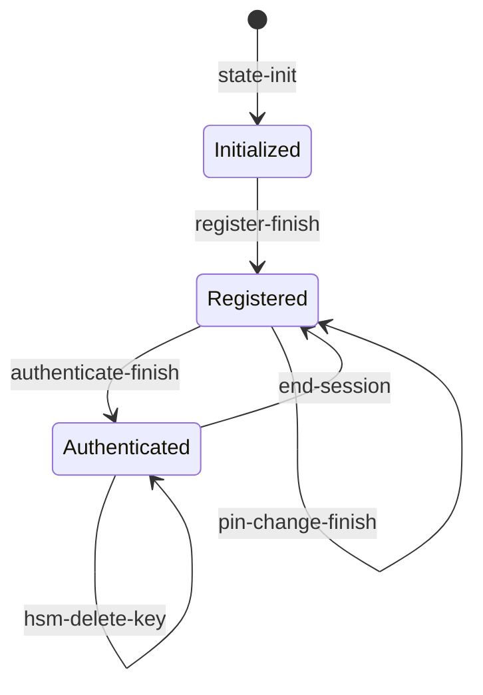
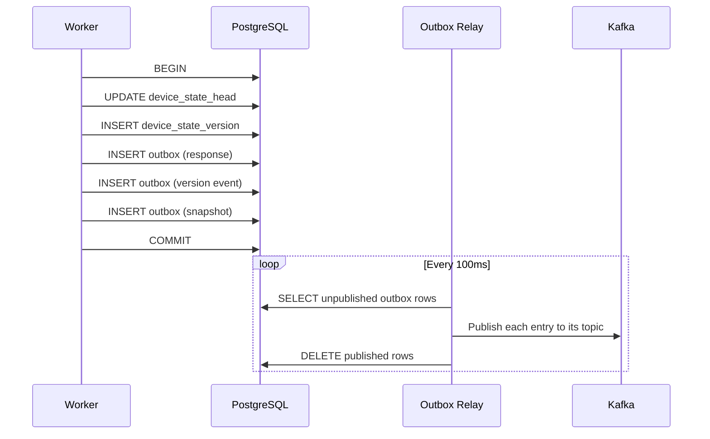

# State Management

Device state is server-owned and persisted in PostgreSQL. The worker is the sole writer; clients never see or hold raw state.

## Device state lifecycle



## DeviceHsmState

The root aggregate contains:

| Field | Type | Description |
|-------|------|-------------|
| `version` | `u64` | Monotonic counter, incremented on each state-mutating operation. Version 0 is the genesis state created by state-init. |
| `device_keys` | `Vec<DeviceKeyEntry>` | Registered device keys, each with an EC public key, optional OPAQUE password files, and an authorization code. |
| `hsm_keys` | `Vec<HsmKey>` | HSM-managed keys, each with a wrapped private key (encrypted by the HSM wrap key), the corresponding EC public key in JWK format, and a creation timestamp. |

State is serialized as JSON, signed as a JWS by the server's private key, and stored in the `device_state_version` table.

## Database schema

```
device_state_head          device_state_version
+-----------+--------+     +-----------+---------+-----------+--------------+----------------+
| device_id | version|     | device_id | version | state_jws | command_type | correlation_id |
+-----------+--------+     +-----------+---------+-----------+--------------+----------------+
| PK        | current|     | PK (composite)      | signed    | audit        | traceability   |
+-----------+--------+     +-----------+---------+-----------+--------------+----------------+
```

- **`device_state_head`**: One row per device, tracks the current version. Used for optimistic concurrency control (`SELECT ... FOR UPDATE`).
- **`device_state_version`**: Append-only log of all state versions. Each row contains the JWS-signed state, the command that produced it, and the correlation ID for traceability.

## Optimistic concurrency

State mutations use optimistic concurrency via the `expected_version` parameter:

1. Load current state (version N)
2. Process operation, produce new state
3. Attempt to persist with `expected_version = N`, `new_version = N + 1`
4. If another write incremented the version in between, the transaction fails with `ConcurrencyConflict`

For state-init (version 0), `expected_version` is `None` and the persistence layer uses `INSERT ... ON CONFLICT DO NOTHING` to detect duplicate initialization.

## Transactional outbox

All state mutations are persisted atomically with outbox entries in a single PostgreSQL transaction. This guarantees that if the state is updated, the corresponding Kafka events will eventually be published.



## Caching

Two caches accelerate state access and provide tamper detection:

### Moka (in-memory)

An LRU cache holding deserialized `DeviceHsmState` objects. Avoids repeated PostgreSQL queries and JWS verification for frequently accessed devices. Populated on cache miss from the database, and updated after each successful state mutation.

### redb (on-disk tamper detection)

A persistent key-value store mapping `device_id` to the last known `version`. Acts as a monotonic version witness: if a loaded state has a version lower than what redb has seen, a rollback attack is detected and the request is rejected with `TamperDetected`.

The redb cache is populated on startup from the log-compacted `state-snapshot` Kafka topic, ensuring tamper detection survives worker restarts.
