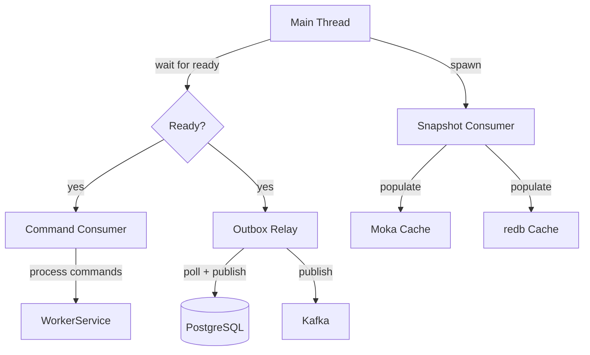
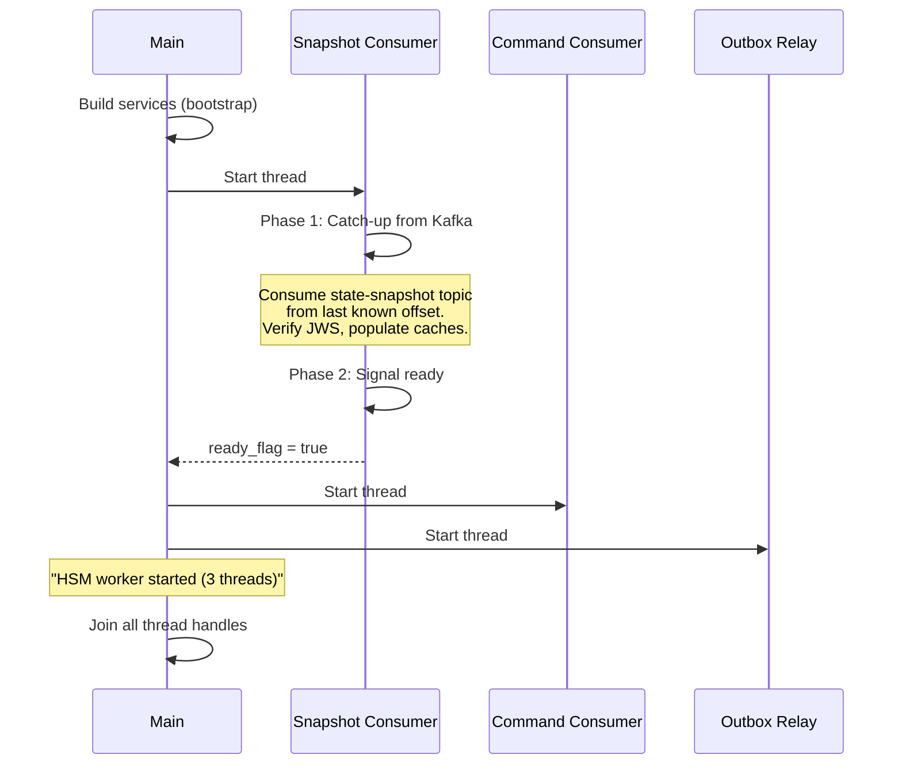

# Threading Model

The HSM Worker runs three threads, coordinated through shared atomic flags for graceful startup and shutdown.

## Thread overview

## Startup sequence

The main thread blocks until the snapshot consumer has caught up with the `state-snapshot` Kafka topic. This ensures the Moka and redb caches are warm before the command consumer begins processing requests.

## Thread 1: Snapshot Consumer

**Purpose**: Warm the in-memory state cache and on-disk tamper detection cache from the log-compacted `state-snapshot` Kafka topic.

**Two-phase operation**:

- **Phase 1 (catch-up)**: Consume from the last persisted offset (stored in redb). For each message, verify the state JWS signature and populate both the Moka state cache and the redb version cache. Catch-up completes after 10 consecutive empty polls.
- **Phase 2 (real-time)**: Tail the topic for new snapshots published by other worker instances (or the outbox relay). Offsets are persisted to redb every 5 seconds.

**Configuration**: No consumer group (manual partition assignment). Offsets are tracked in redb, not Kafka.

## Thread 2: Command Consumer

**Purpose**: Consume commands from the requests Kafka topic and invoke the `WorkerService`.

**Behavior**: Subscribes to the requests topic using a consumer group with cooperative-sticky partition assignment and static group membership. For each message, deserializes the command and calls either `execute()` (standard commands) or `execute_state_init()` (device initialization).

## Thread 3: Outbox Relay

**Purpose**: Poll the PostgreSQL `outbox` table and publish entries to their designated Kafka topics.

**Behavior**: Every 100ms, queries for unpublished rows, publishes each to its target topic, and deletes the row on success. Guarantees at-least-once delivery. Reconnects with 1-second backoff on PostgreSQL errors.

**Topics published to**:
- `responses` -- Worker responses delivered to clients via the BFF
- `state-versions` -- Audit events
- `state-snapshot` -- Log-compacted topic for cache warm-up

## Shutdown

A Ctrl-C signal sets the shared `running` flag to `false`. All three threads check this flag in their poll loops and exit gracefully. The main thread joins all thread handles before terminating.
