# Operations Guide

This document provides a complete reference for all operations supported by the HSM Worker.

## Operation Categories

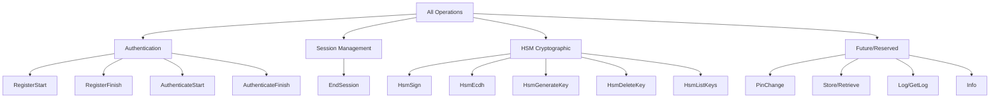

## Quick Reference Table

| Operation | Encryption | Session Required | State Change | Purpose |
|-----------|------------|------------------|--------------|---------|
| [RegisterStart](#registerstart) | Device | No | Yes | Begin device registration |
| [RegisterFinish](#registerfinish) | Device | No | Yes | Complete registration, store password file |
| [AuthenticateStart](#authenticatestart) | Device | No | No | Begin authentication |
| [AuthenticateFinish](#authenticatefinish) | Device | No | No | Complete auth, establish session |
| [EndSession](#endsession) | Device | No | No | Terminate active session |
| [HsmSign](#hsmsign) | Session | Yes | No | ECDSA signature generation |
| [HsmEcdh](#hsmecdh) | Session | Yes | No | ECDH shared secret derivation |
| [HsmGenerateKey](#hsmgeneratekey) | Session | Yes | Yes | Generate new EC keypair |
| [HsmDeleteKey](#hsmdeletekey) | Session | Yes | Yes | Delete existing key |
| [HsmListKeys](#hsmlistkeys) | Session | Yes | No | List all device keys |

---

## Authentication Operations

### RegisterStart

Begin the OPAQUE registration process for a new device.

**Operation ID:** `"RegisterStart"`  
**Encryption:** Device (ECDH-ES)  
**Session Required:** No  
**State Change:** Yes (creates password file)

#### Request Data

```json
{
  "data": "base64-encoded-opaque-client-registration-start"
}
```

**Fields:**
- `data`: Base64-encoded OPAQUE client registration start message (binary protocol data)

#### Response Data

```json
{
  "data": "base64-encoded-opaque-server-response"
}
```

**Fields:**
- `data`: Base64-encoded OPAQUE server response for registration

#### Usage Flow

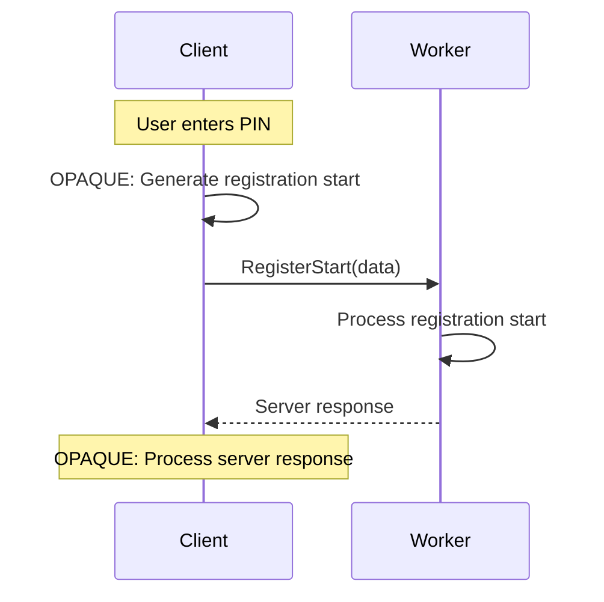

#### Example

**InnerRequest:**
```json
{
  "version": 1,
  "operationId": "RegisterStart",
  "data": "{\"data\":\"AgECAwQFBgcICQoLDA0ODxAREhMUFRYXGBkaGxwdHh8=\"}"
}
```

**InnerResponse:**
```json
{
  "version": 1,
  "status": "OK",
  "data": "{\"data\":\"ICEiIyQlJicoKSorLC0uLzAxMjM0NTY3ODk6Ozw9Pj9A\"}",
  "expiresIn": null
}
```

---

### RegisterFinish

Complete the OPAQUE registration process.

**Operation ID:** `"RegisterFinish"`  
**Encryption:** Device (ECDH-ES)  
**Session Required:** No  
**State Change:** Yes (stores password file in state)

#### Request Data

```json
{
  "data": "base64-encoded-opaque-client-registration-finish"
}
```

#### Response Data

```json
{
  "task": "registration_complete"
}
```

**Fields:**
- `task`: Task identifier (always `"registration_complete"` for this operation)

#### Usage Flow

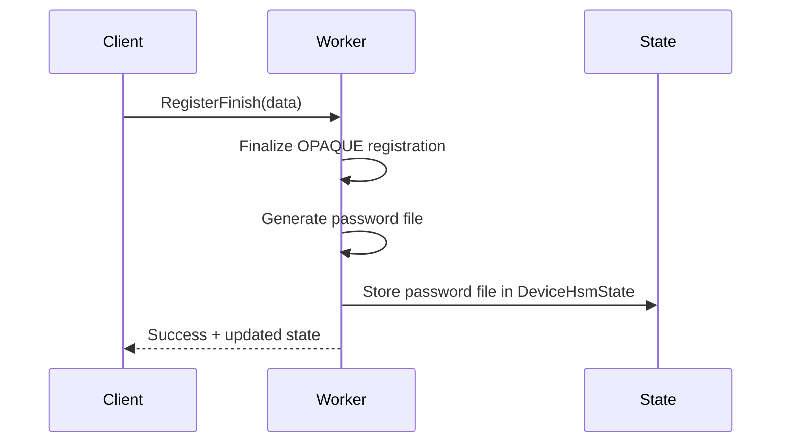

#### Example

**InnerRequest:**
```json
{
  "version": 1,
  "operationId": "RegisterFinish",
  "data": "{\"data\":\"QUJDREVGR0hJSktMTU5PUFFSU1RVVldYWVphYmNkZWY=\"}"
}
```

**InnerResponse:**
```json
{
  "version": 1,
  "status": "OK",
  "data": "{\"task\":\"registration_complete\"}",
  "expiresIn": null
}
```

**Note:** The response will include an updated `stateJws` containing the password file.

---

### AuthenticateStart

Begin the OPAQUE authentication process.

**Operation ID:** `"AuthenticateStart"`  
**Encryption:** Device (ECDH-ES)  
**Session Required:** No  
**State Change:** No

#### Request Data

```json
{
  "data": "base64-encoded-opaque-client-auth-start"
}
```

#### Response Data

```json
{
  "task": null,
  "data": "base64-encoded-opaque-server-challenge"
}
```

**Fields:**
- `task`: Always `null` for this operation
- `data`: OPAQUE server challenge for authentication

#### Usage Flow

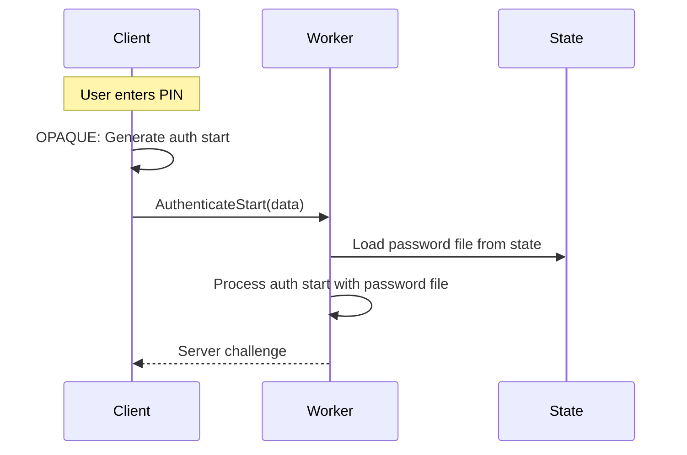

#### Example

**InnerRequest:**
```json
{
  "version": 1,
  "operationId": "AuthenticateStart",
  "data": "{\"data\":\"Z2hpamtsbW5vcHFyc3R1dnd4eXowMTIzNDU2Nzg5Cg==\"}"
}
```

**InnerResponse:**
```json
{
  "version": 1,
  "status": "OK",
  "data": "{\"task\":null,\"data\":\"QUJDREVGXx0hdnd4eXowMTIzNDU2Nzg5Cg==\"}",
  "expiresIn": null
}
```

---

### AuthenticateFinish

Complete the OPAQUE authentication and establish a session.

**Operation ID:** `"AuthenticateFinish"`  
**Encryption:** Device (ECDH-ES)  
**Session Required:** No  
**State Change:** No  
**Side Effect:** Creates session

#### Request Data

```json
{
  "data": "base64-encoded-opaque-client-auth-finish"
}
```

#### Response Data

```json
{
  "task": "authentication_complete"
}
```

**Fields:**
- `task`: Task identifier (always `"authentication_complete"`)

#### Response Headers

The `OuterResponse` will include a `sessionId`:

```json
{
  "version": 1,
  "innerJwe": "...",
  "sessionId": "7c9e6679-7425-40de-944b-e07fc1f90ae7"
}
```

The `InnerResponse` includes session TTL:

```json
{
  "version": 1,
  "status": "OK",
  "data": "{\"task\":\"authentication_complete\"}",
  "expiresIn": "PT300S"
}
```

#### Usage Flow

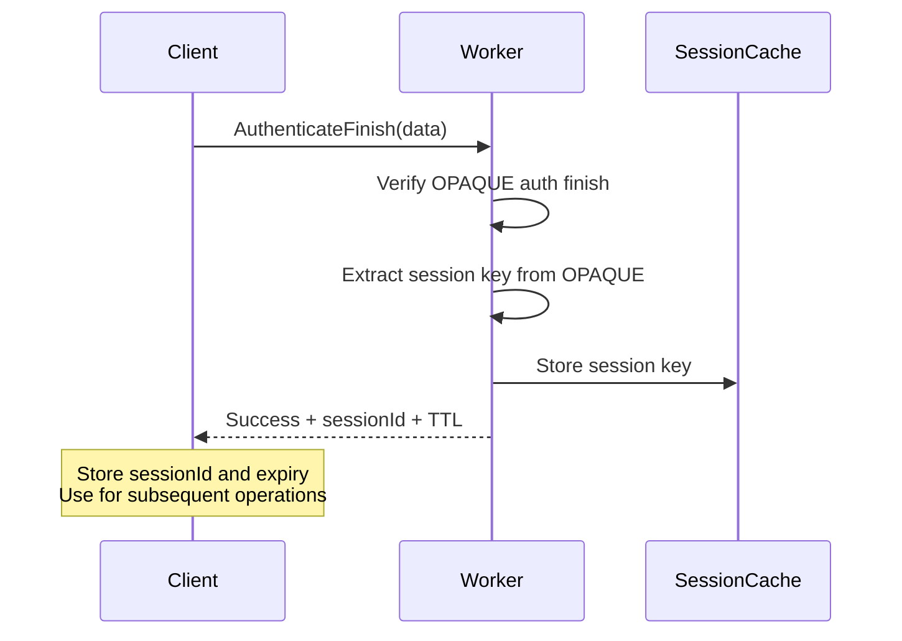

#### Example

**InnerRequest:**
```json
{
  "version": 1,
  "operationId": "AuthenticateFinish",
  "data": "{\"data\":\"bm9wcXJzdHV2d3h5ejAxMjM0NTY3ODkKQUJDREVGCg==\"}"
}
```

**OuterResponse:**
```json
{
  "version": 1,
  "innerJwe": "eyJhbGc...",
  "sessionId": "7c9e6679-7425-40de-944b-e07fc1f90ae7"
}
```

**InnerResponse:**
```json
{
  "version": 1,
  "status": "OK",
  "data": "{\"task\":\"authentication_complete\"}",
  "expiresIn": "PT300S"
}
```

**Client Action:** Store the `sessionId` and calculate expiry time (current time + 300 seconds).

---

## Session Management Operations

### EndSession

Terminate an active session.

**Operation ID:** `"EndSession"`  
**Encryption:** Device (ECDH-ES)  
**Session Required:** No  
**State Change:** No  
**Side Effect:** Removes session from cache

#### Request Data

```json
{
  "sessionId": "7c9e6679-7425-40de-944b-e07fc1f90ae7"
}
```

**Fields:**
- `sessionId`: Session to terminate

#### Response Data

Empty response (no data).

#### Usage Flow

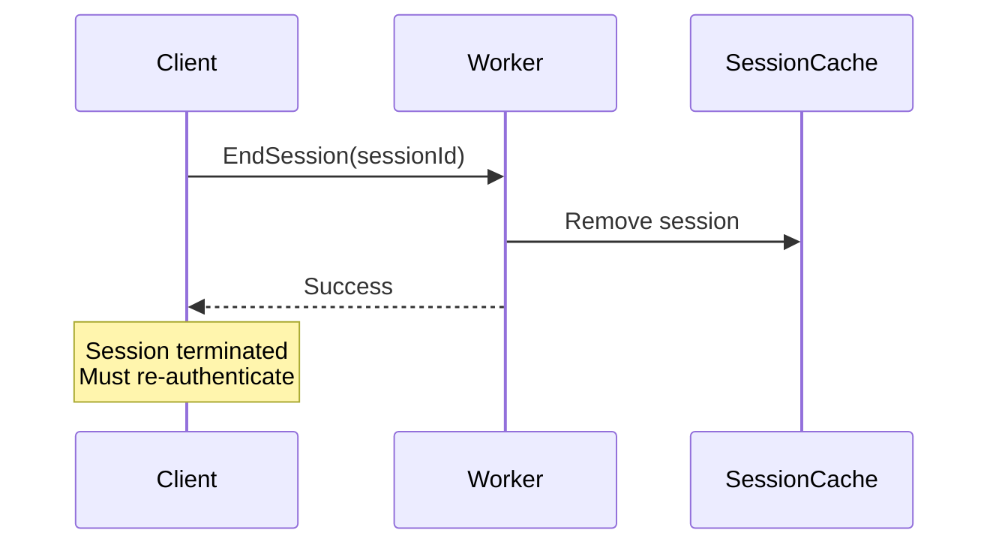

#### Example

**InnerRequest:**
```json
{
  "version": 1,
  "operationId": "EndSession",
  "data": "{\"sessionId\":\"7c9e6679-7425-40de-944b-e07fc1f90ae7\"}"
}
```

**InnerResponse:**
```json
{
  "version": 1,
  "status": "OK",
  "data": "{}",
  "expiresIn": null
}
```

---

## HSM Cryptographic Operations

All HSM operations require an active session.

### HsmSign

Generate ECDSA signatures using an HSM-managed key.

**Operation ID:** `"HsmSign"`  
**Encryption:** Session (dir + AES-GCM)  
**Session Required:** Yes  
**State Change:** No

#### Request Data

```json
{
  "keyId": "signing-key-1",
  "messages": [
    "SGVsbG8gV29ybGQ=",
    "Rm9vQmFy"
  ]
}
```

**Fields:**
- `keyId`: ID of HSM key to use (must exist in `state.hsmKeys`)
- `messages`: Array of base64-encoded messages to sign

**Message Encoding:**
```javascript
// JavaScript example
const message = "Hello World";
const base64 = btoa(message); // "SGVsbG8gV29ybGQ="
```

#### Response Data

```json
{
  "keyId": "signing-key-1",
  "signatures": [
    "MEUCIQDxyz123...",
    "MEYCIQC789abc..."
  ]
}
```

**Fields:**
- `keyId`: Echo of request key ID
- `signatures`: Array of base64-encoded DER signatures (same order as messages)

**Signature Format:**
- DER-encoded ECDSA signature
- Contains `r` and `s` components
- Base64-encoded for transport

#### Usage Flow

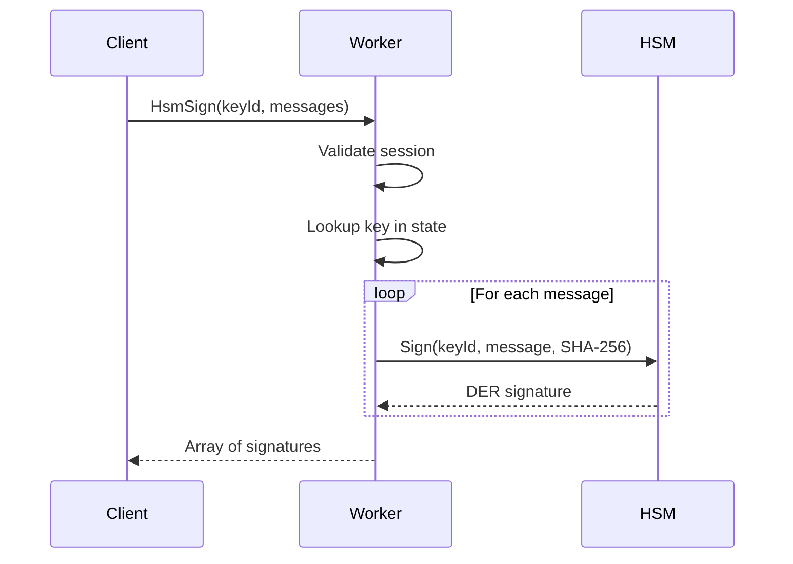

#### Example

**InnerRequest:**
```json
{
  "version": 1,
  "operationId": "HsmSign",
  "data": "{\"keyId\":\"signing-key-1\",\"messages\":[\"SGVsbG8gV29ybGQ=\",\"Rm9vQmFy\"]}"
}
```

**InnerResponse:**
```json
{
  "version": 1,
  "status": "OK",
  "data": "{\"keyId\":\"signing-key-1\",\"signatures\":[\"MEUCIQD...\",\"MEYCIQC...\"]}",
  "expiresIn": "PT300S"
}
```

#### Error Scenarios

| Error | Cause |
|-------|-------|
| `UnknownSession` | Session expired or invalid |
| `HsmKeyNotFound` | `keyId` doesn't exist in device's HSM keys |
| `HsmOperationFailed` | HSM internal error (key inaccessible, etc.) |

---

### HsmEcdh

Perform Elliptic Curve Diffie-Hellman key agreement.

**Operation ID:** `"HsmEcdh"`  
**Encryption:** Session (dir + AES-GCM)  
**Session Required:** Yes  
**State Change:** No

#### Request Data

```json
{
  "keyId": "ecdh-key-1",
  "peerPublicKeys": [
    {
      "kty": "EC",
      "crv": "P-256",
      "x": "WKn-ZIGevcwGIyyrzFoZNBdaq9_TsqzGl96oc0CWuis",
      "y": "y77t-RvAHRKTsSGdIYUfweuOvwrvDD-Q3Hv5J0fSKbE"
    }
  ]
}
```

**Fields:**
- `keyId`: ID of HSM key to use
- `peerPublicKeys`: Array of peer public keys (JWK format)

#### Response Data

```json
{
  "keyId": "ecdh-key-1",
  "sharedSecrets": [
    "aq8rlQ2xKkYrFVOvJkEb6A=="
  ]
}
```

**Fields:**
- `keyId`: Echo of request key ID
- `sharedSecrets`: Array of base64-encoded shared secrets (raw bytes)

#### Example

**InnerRequest:**
```json
{
  "version": 1,
  "operationId": "HsmEcdh",
  "data": "{\"keyId\":\"ecdh-key-1\",\"peerPublicKeys\":[{\"kty\":\"EC\",\"crv\":\"P-256\",\"x\":\"WKn-ZIGevcwGIyyrzFoZNBdaq9_TsqzGl96oc0CWuis\",\"y\":\"y77t-RvAHRKTsSGdIYUfweuOvwrvDD-Q3Hv5J0fSKbE\"}]}"
}
```

**InnerResponse:**
```json
{
  "version": 1,
  "status": "OK",
  "data": "{\"keyId\":\"ecdh-key-1\",\"sharedSecrets\":[\"aq8rlQ2xKkYrFVOvJkEb6A==\"]}",
  "expiresIn": "PT300S"
}
```

**Security Note:** The shared secret should be fed into a KDF (e.g., HKDF) before use as a key.

---

### HsmGenerateKey

Generate a new EC keypair in the HSM.

**Operation ID:** `"HsmGenerateKey"`  
**Encryption:** Session (dir + AES-GCM)  
**Session Required:** Yes  
**State Change:** Yes (adds key to state)

#### Request Data

```json
{
  "keyId": "new-signing-key",
  "curve": "P-256"
}
```

**Fields:**
- `keyId`: Identifier for the new key (must be unique for this device)
- `curve`: Elliptic curve (`"P-256"`, `"P-384"`, or `"P-521"`)

#### Response Data

```json
{
  "keyId": "new-signing-key",
  "curve": "P-256",
  "publicKey": {
    "kty": "EC",
    "crv": "P-256",
    "x": "MKBCTNIcKUSDii11ySs3526iDZ8AiTo7Tu6KPAqv7D4",
    "y": "4Etl6SRW2YiLUrN5vfvVHuhp7x8PxltmWWlbbM4IFyM"
  }
}
```

**Fields:**
- `keyId`: Echo of request key ID
- `curve`: Echo of request curve
- `publicKey`: Public key in JWK format

#### Usage Flow

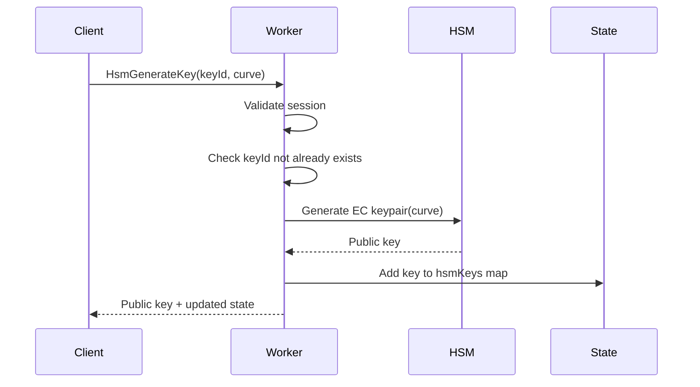

#### Example

**InnerRequest:**
```json
{
  "version": 1,
  "operationId": "HsmGenerateKey",
  "data": "{\"keyId\":\"new-signing-key\",\"curve\":\"P-256\"}"
}
```

**InnerResponse:**
```json
{
  "version": 1,
  "status": "OK",
  "data": "{\"keyId\":\"new-signing-key\",\"curve\":\"P-256\",\"publicKey\":{\"kty\":\"EC\",\"crv\":\"P-256\",\"x\":\"MKBCTNIcKUSDii11ySs3526iDZ8AiTo7Tu6KPAqv7D4\",\"y\":\"4Etl6SRW2YiLUrN5vfvVHuhp7x8PxltmWWlbbM4IFyM\"}}",
  "expiresIn": "PT300S"
}
```

**State Change:**
```json
{
  "hsmKeys": {
    "new-signing-key": {
      "curve": "P-256",
      "publicKey": { ... }
    }
  }
}
```

---

### HsmDeleteKey

Delete an HSM-managed key.

**Operation ID:** `"HsmDeleteKey"`  
**Encryption:** Session (dir + AES-GCM)  
**Session Required:** Yes  
**State Change:** Yes (removes key from state)

#### Request Data

```json
{
  "keyId": "old-key-to-delete"
}
```

**Fields:**
- `keyId`: ID of key to delete

#### Response Data

```json
{
  "keyId": "old-key-to-delete"
}
```

**Fields:**
- `keyId`: Echo of deleted key ID

#### Usage Flow

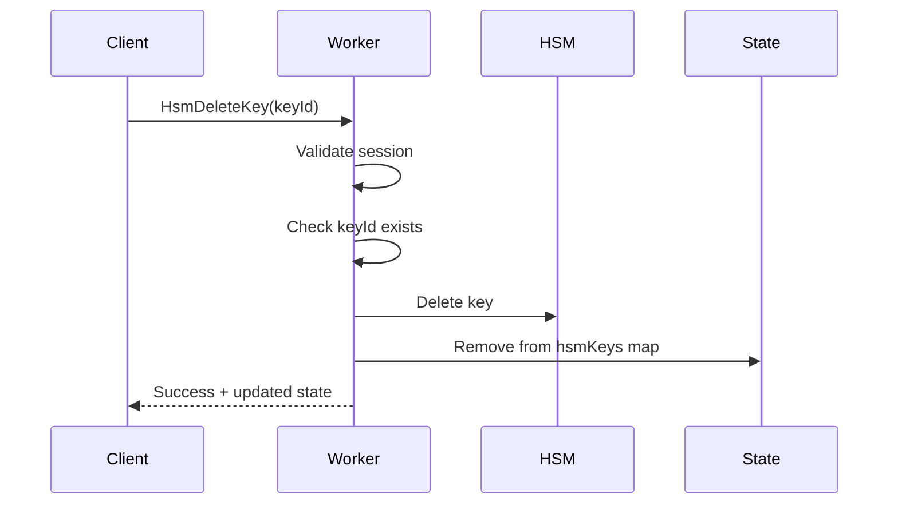

#### Example

**InnerRequest:**
```json
{
  "version": 1,
  "operationId": "HsmDeleteKey",
  "data": "{\"keyId\":\"old-key-to-delete\"}"
}
```

**InnerResponse:**
```json
{
  "version": 1,
  "status": "OK",
  "data": "{\"keyId\":\"old-key-to-delete\"}",
  "expiresIn": "PT300S"
}
```

---

### HsmListKeys

List all HSM-managed keys for this device.

**Operation ID:** `"HsmListKeys"`  
**Encryption:** Session (dir + AES-GCM)  
**Session Required:** Yes  
**State Change:** No

#### Request Data

Empty (no fields required).

```json
{}
```

#### Response Data

```json
{
  "keys": [
    {
      "keyId": "signing-key-1",
      "curve": "P-256",
      "publicKey": {
        "kty": "EC",
        "crv": "P-256",
        "x": "...",
        "y": "..."
      }
    },
    {
      "keyId": "ecdh-key-1",
      "curve": "P-384",
      "publicKey": {
        "kty": "EC",
        "crv": "P-384",
        "x": "...",
        "y": "..."
      }
    }
  ]
}
```

**Fields:**
- `keys`: Array of key metadata objects
  - `keyId`: Key identifier
  - `curve`: Elliptic curve
  - `publicKey`: Public key in JWK format

#### Example

**InnerRequest:**
```json
{
  "version": 1,
  "operationId": "HsmListKeys",
  "data": "{}"
}
```

**InnerResponse:**
```json
{
  "version": 1,
  "status": "OK",
  "data": "{\"keys\":[{\"keyId\":\"signing-key-1\",\"curve\":\"P-256\",\"publicKey\":{...}},{\"keyId\":\"ecdh-key-1\",\"curve\":\"P-384\",\"publicKey\":{...}}]}",
  "expiresIn": "PT300S"
}
```

---

## Future/Reserved Operations

The following operations are defined but not yet implemented:

### PinChange

Change the device PIN/password.

**Status:** Reserved  
**Operation ID:** `"PinChange"`  
**Encryption:** Session  
**Session Required:** Yes  
**State Change:** Yes (updates password file)

### Store / Retrieve

Secure data storage for the device.

**Status:** Reserved  
**Operation IDs:** `"Store"`, `"Retrieve"`  
**Encryption:** Session  
**Session Required:** Yes

### Log / GetLog

Audit logging for device operations.

**Status:** Reserved  
**Operation IDs:** `"Log"`, `"GetLog"`  
**Encryption:** Session  
**Session Required:** Yes

### Info

Retrieve worker/server information.

**Status:** Reserved  
**Operation ID:** `"Info"`  
**Encryption:** Session  
**Session Required:** Yes

---

## Operation Workflow Patterns

### Initial Setup (New Device)

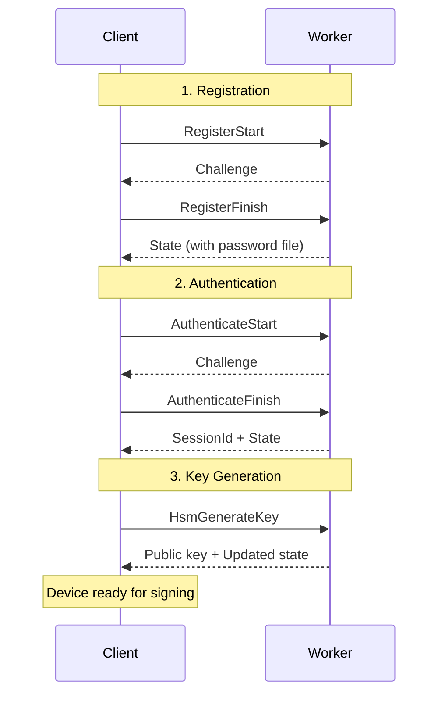

### Typical Session

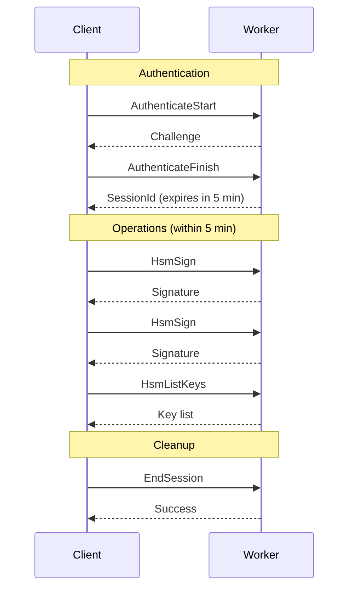

### Session Expiry Handling

```javascript
class RemoteSigningClient {
  async performOperation(operationId, data) {
    // Check if session needs refresh
    if (this.session.needsRefresh()) {
      await this.reauthenticate();
    }
    
    try {
      return await this.sendRequest(operationId, data);
    } catch (error) {
      if (error.code === 'UnknownSession') {
        // Session expired, re-authenticate and retry
        await this.reauthenticate();
        return await this.sendRequest(operationId, data);
      }
      throw error;
    }
  }
}
```

## Best Practices

### Key Management

1. **Unique Key IDs**: Use descriptive, unique identifiers
   ```javascript
   keyId: `signing-${purpose}-${timestamp}`
   ```

2. **Key Lifecycle**: Track key creation time, usage, rotation schedule

3. **Key Deletion**: Only delete keys when truly no longer needed (signatures may need verification)

### Batch Operations

For multiple signatures, use single `HsmSign` request with array of messages:

```json
// Efficient: Single request
{
  "keyId": "signing-key-1",
  "messages": ["msg1", "msg2", "msg3"]
}

// Inefficient: Three requests
// HsmSign("msg1")
// HsmSign("msg2")
// HsmSign("msg3")
```

### Error Recovery

Always handle session expiry gracefully:

```javascript
async function signWithRetry(keyId, messages) {
  try {
    return await hsmSign(keyId, messages);
  } catch (error) {
    if (error.code === 'UnknownSession') {
      await authenticate();
      return await hsmSign(keyId, messages); // Retry once
    }
    throw error;
  }
}
```
