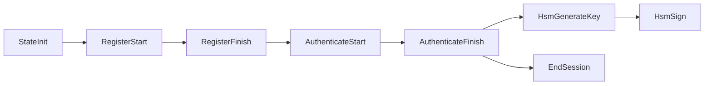

# Operations

The HSM Worker supports 12 operations, dispatched by the `OperationId` in the inner request payload.

## Operation summary

| Operation | Mutates State | Session Required | Encrypt With | Description |
|-----------|:---:|:---:|---|---|
| **StateInit** | Yes | No | Device key | Creates version 0 state with the device's public key. Returns `device_id` and `dev_authorization_code`. |
| **RegisterStart** | No | No | Device key | Begins OPAQUE registration. Requires the authorization code from state-init. Returns the server's registration response. |
| **RegisterFinish** | Yes | No | Device key | Completes OPAQUE registration. Stores the password file in state. |
| **AuthenticateStart** | No | No | Device key | Begins OPAQUE authentication. Returns the server's authentication response. |
| **AuthenticateFinish** | No | No | Device key | Completes OPAQUE authentication. Derives and stores a session key. |
| **ChangePinStart** | No | Yes | Session key | Begins PIN change via new OPAQUE registration within an authenticated session. |
| **ChangePinFinish** | Yes | Yes | Session key | Completes PIN change. Replaces the password file in state. |
| **HsmGenerateKey** | Yes | Yes | Session key | Generates an EC key pair in the HSM. Stores the wrapped private key and public key in state. |
| **HsmSign** | No | Yes | Session key | Signs a payload using an HSM-held private key. Returns the DER-encoded ECDSA signature. |
| **HsmDeleteKey** | Yes | Yes | Session key | Removes an HSM key from state. |
| **HsmListKeys** | No | Yes | Session key | Lists all HSM keys in the current state with their public keys. |
| **EndSession** | No | Yes | Session key | Invalidates the session key. |

## Operation flow: device lifecycle

A typical device goes through these operations in order:

1. **Initialize**: The BFF sends a state-init command with the device's public key. The worker creates version 0 state and returns an authorization code.
2. **Register PIN**: The device uses the authorization code to complete OPAQUE registration (two round trips).
3. **Authenticate**: The device authenticates with its PIN via OPAQUE (two round trips). On success, a session key is derived.
4. **Use HSM**: Within the authenticated session, the device can generate keys, sign payloads, list keys, or delete keys.
5. **End session**: The session key is invalidated.

## State-mutating vs read-only

Operations that return `state: Some(new_state)` in their result are state-mutating. These go through the full persist-and-respond pipeline (atomic PostgreSQL transaction with outbox entries, cache updates). Read-only operations bypass persistence and publish their response directly to Kafka.

## Dependencies

Operations may depend on infrastructure ports:

| Dependency | Used by |
|------------|---------|
| **PakePort** (OPAQUE) | RegisterStart, RegisterFinish, AuthenticateStart, AuthenticateFinish, ChangePinStart, ChangePinFinish |
| **HsmSpiPort** (PKCS#11) | HsmGenerateKey, HsmSign |
| **SessionKeySpiPort** | AuthenticateFinish, ChangePinFinish, EndSession |
| *(none)* | StateInit, HsmDeleteKey, HsmListKeys |
