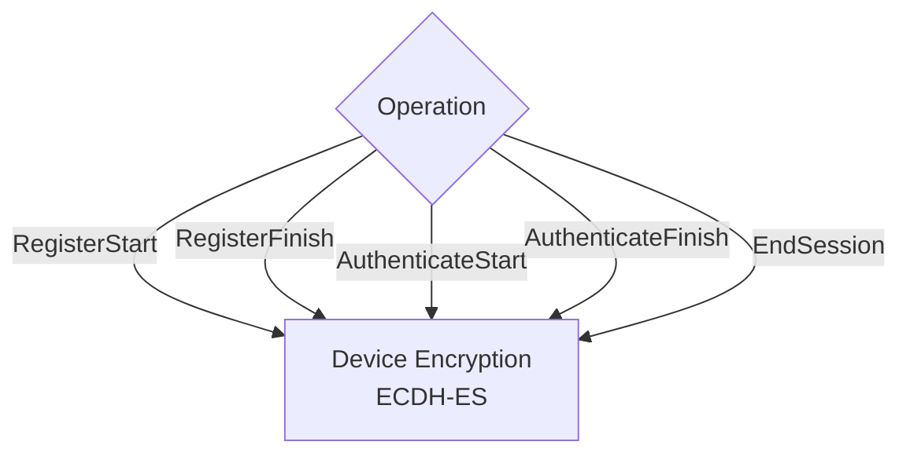
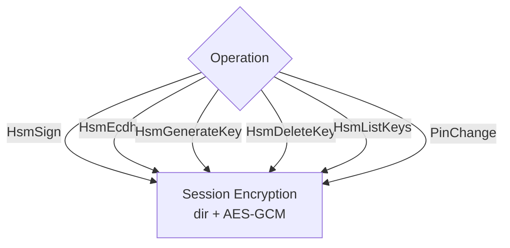
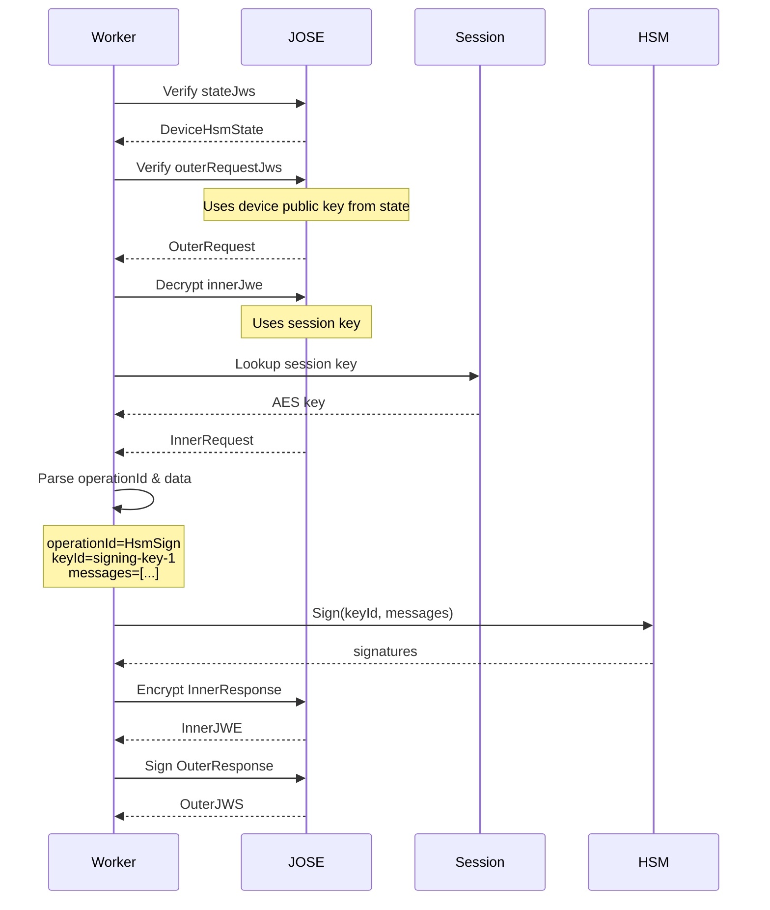

# Protocol Flow

This document provides a detailed explanation of the request/response protocol, including message structure, encryption layers, and example payloads.

## Protocol Layers

The protocol uses multiple layers of signing and encryption for security:

```
Layer 1: Kafka Message (HsmWorkerRequestDto)
   ↓
Layer 2: Device State JWS (TypedJws<DeviceHsmState>)
   ↓
Layer 3: Outer Request JWS (TypedJws<OuterRequest>)
   ↓
Layer 4: Inner Request JWE (TypedJwe<InnerRequest>)
   ↓
Layer 5: Operation Data (JSON)
```

### Why Multiple Layers?

Each layer serves a specific security purpose:

| Layer | Type | Purpose | Key Used |
|-------|------|---------|----------|
| **State JWS** | Signature | Prove state integrity, prevent tampering | Worker's signing key |
| **Outer JWS** | Signature | Prove request authenticity | Device's private key |
| **Inner JWE** | Encryption | Protect sensitive operation data | Device key or session key |

## Message Structure

### Request Message (Kafka)

```json
{
  "requestId": "550e8400-e29b-41d4-a716-446655440000",
  "stateJws": "eyJhbGc....<DeviceHsmState>....sig",
  "outerRequestJws": "eyJhbGc....<OuterRequest>....sig"
}
```

**Fields:**
- `requestId`: UUID for correlation (same in request and response)
- `stateJws`: Signed device state (compact JWS format)
- `outerRequestJws`: Signed outer envelope (compact JWS format)

### Response Message (Kafka)

```json
{
  "requestId": "550e8400-e29b-41d4-a716-446655440000",
  "httpStatus": 200,
  "stateJws": "eyJhbGc....<DeviceHsmState>....sig",
  "serviceResponseJws": "eyJhbGc....<OuterResponse>....sig"
}
```

**Fields:**
- `requestId`: Matches the request (for correlation)
- `httpStatus`: Suggested HTTP status (200, 400, 401, 500, etc.)
- `stateJws`: Updated device state (may be same as request if unchanged)
- `serviceResponseJws`: Signed outer response envelope

## Device State (Layer 2)

### State JWS Structure

The state JWS is signed by the HSM worker to prevent tampering.

**JWS Header:**
```json
{
  "alg": "ES256",
  "kid": "worker-key-2024-01"
}
```

**JWS Payload (DeviceHsmState):**
```json
{
  "version": 1,
  "deviceId": "device-abc-123",
  "publicKey": {
    "kty": "EC",
    "crv": "P-256",
    "x": "WKn-ZIGevcwGIyyrzFoZNBdaq9_TsqzGl96oc0CWuis",
    "y": "y77t-RvAHRKTsSGdIYUfweuOvwrvDD-Q3Hv5J0fSKbE"
  },
  "passwordFile": "AgECAwQ...base64-opaque-data...==",
  "hsmKeys": {
    "signing-key-1": {
      "curve": "P-256",
      "publicKey": {
        "kty": "EC",
        "crv": "P-256",
        "x": "MKBCTNIcKUSDii11ySs3526iDZ8AiTo7Tu6KPAqv7D4",
        "y": "4Etl6SRW2YiLUrN5vfvVHuhp7x8PxltmWWlbbM4IFyM"
      }
    }
  }
}
```

**Field Explanation:**
- `version`: Protocol version (currently 1)
- `deviceId`: Unique device identifier
- `publicKey`: Device's public key (for ECDH-ES encryption)
- `passwordFile`: OPAQUE password file (base64-encoded binary data)
- `hsmKeys`: Map of key-id → key metadata for HSM-managed keys

**State Lifecycle:**
1. **Initial Registration**: State created with device public key and password file
2. **Key Generation**: New entries added to `hsmKeys`
3. **Key Deletion**: Entries removed from `hsmKeys`
4. **Every Request**: State validated and returned (updated if changed)

## Outer Envelope (Layer 3)

### Outer Request JWS

Signed by the **device's private key** to prove request authenticity.

**JWS Header:**
```json
{
  "alg": "ES256",
  "kid": "device-abc-123"
}
```

**JWS Payload (OuterRequest):**
```json
{
  "version": 1,
  "innerJwe": "eyJhbGc....<InnerRequest>....tag"
}
```

**Verification:**
The worker verifies this JWS using:
1. Extract device public key from `DeviceHsmState`
2. Verify signature using `kid` from header
3. Ensures request came from legitimate device

### Outer Response JWS

Signed by the **worker's signing key** to prove response authenticity.

**JWS Header:**
```json
{
  "alg": "ES256",
  "kid": "worker-key-2024-01"
}
```

**JWS Payload (OuterResponse):**
```json
{
  "version": 1,
  "innerJwe": "eyJhbGc....<InnerResponse>....tag",
  "sessionId": "7c9e6679-7425-40de-944b-e07fc1f90ae7"
}
```

**Fields:**
- `version`: Protocol version
- `innerJwe`: Encrypted inner response
- `sessionId`: Active session ID (if session-based operation)

## Inner Envelope (Layer 4)

### Inner Request JWE

The inner request is **encrypted** to protect sensitive operation data.

#### Device Encryption (ECDH-ES)

Used for operations **before authentication** (registration, authentication start/finish).

**JWE Header:**
```json
{
  "alg": "ECDH-ES",
  "enc": "A256GCM",
  "epk": {
    "kty": "EC",
    "crv": "P-256",
    "x": "gI0GAILBdu7T53akrFmMyGcsF3n5dO7MmwNBHKW5SV0",
    "y": "SLW_xSffzlPWrHEVI30DHM_4egVwt3NQqeUD7nMFpps"
  }
}
```

**Decryption:**
1. Worker extracts ephemeral public key from `epk`
2. Performs ECDH with device's private key (from HSM if device key is HSM-managed)
3. Derives AES-256-GCM key
4. Decrypts ciphertext

#### Session Encryption (Direct AES)

Used for operations **after authentication** (HSM operations, session-based ops).

**JWE Header:**
```json
{
  "alg": "dir",
  "enc": "A256GCM",
  "kid": "session:7c9e6679-7425-40de-944b-e07fc1f90ae7"
}
```

**Decryption:**
1. Worker extracts session ID from `kid`
2. Looks up session key in session cache
3. Directly uses session key for AES-256-GCM decryption

### Inner Request Payload

**Structure (InnerRequest):**
```json
{
  "version": 1,
  "operationId": "HsmSign",
  "data": "{\"keyId\":\"signing-key-1\",\"messages\":[\"SGVsbG8gV29ybGQ=\"]}"
}
```

**Fields:**
- `version`: Protocol version
- `operationId`: Operation to perform (see [Operations Guide](operations.md))
- `data`: JSON-encoded operation-specific payload (as a string)

### Inner Response Payload

**Structure (InnerResponse):**
```json
{
  "version": 1,
  "status": "OK",
  "data": "{\"signatures\":[\"MEUCIQDx...\"],\"keyId\":\"signing-key-1\"}",
  "expiresIn": "PT300S"
}
```

**Fields:**
- `version`: Protocol version
- `status`: `"OK"` or `"ERROR"`
- `data`: JSON-encoded operation response (as a string)
- `expiresIn`: ISO 8601 duration for session TTL (optional)

## Encryption Mode Selection

Different operations use different encryption modes:

### Device Encryption Operations

These operations occur **before or without** an active session:



**Why device encryption?**
- No session key exists yet (registration/authentication)
- EndSession doesn't require session (can end expired session)

### Session Encryption Operations

These operations require an **active authenticated session**:



**Why session encryption?**
- Faster (no ECDH key agreement needed)
- Proves client authenticated successfully
- Session key unknown to others

## Complete Example Flow

### Example: HsmSign Operation

#### 1. Client Prepares Request

**Inner Request (before encryption):**
```json
{
  "version": 1,
  "operationId": "HsmSign",
  "data": "{\"keyId\":\"signing-key-1\",\"messages\":[\"SGVsbG8gV29ybGQ=\"]}"
}
```

**Encrypt with session key → Inner JWE:**
```
eyJhbGciOiJkaXIiLCJlbmMiOiJBMjU2R0NNIiwia2lkIjoic2Vzc2lvbjo3YzllNjY3OS03NDI1LTQwZGUtOTQ0Yi1lMDdmYzFmOTBhZTcifQ..IV.ciphertext.tag
```

**Outer Request (before signing):**
```json
{
  "version": 1,
  "innerJwe": "eyJhbGc..."
}
```

**Sign with device key → Outer JWS:**
```
eyJhbGciOiJFUzI1NiIsImtpZCI6ImRldmljZS1hYmMtMTIzIn0.eyJ2ZXJzaW9uIjoxLCJpbm5lckp3ZSI6ImV5SmhiR2NpT2lKa2FYSWlMQ0psYm1NaU9pSkJNalUyUjBOTklpd2lhMmxrSWpvaWMyVnpjMmx2Ymo4M1l6bGxOalkzT1MwM05ESTFMVFF3WkdVdE9UUTBZaTFsTURkbVl6Rm1PVEJOW1RjaWZRLi5JVi5jaXBoZXJ0ZXh0LnRhZyJ9.signature
```

**Final Kafka Message:**
```json
{
  "requestId": "req-12345",
  "stateJws": "eyJhbGc...<state>...sig",
  "outerRequestJws": "eyJhbGc...<outer>...sig"
}
```

#### 2. Worker Processes Request



#### 3. Worker Returns Response

**Inner Response (before encryption):**
```json
{
  "version": 1,
  "status": "OK",
  "data": "{\"signatures\":[\"MEUCIQDxABCD...\"],\"keyId\":\"signing-key-1\"}",
  "expiresIn": "PT300S"
}
```

**Encrypt → Inner JWE**

**Outer Response (before signing):**
```json
{
  "version": 1,
  "innerJwe": "eyJhbGc...",
  "sessionId": "7c9e6679-7425-40de-944b-e07fc1f90ae7"
}
```

**Sign → Outer JWS**

**Final Response:**
```json
{
  "requestId": "req-12345",
  "httpStatus": 200,
  "stateJws": "eyJhbGc...<unchanged state>...sig",
  "serviceResponseJws": "eyJhbGc...<outer response>...sig"
}
```

## Error Handling

### Error Response Structure

When an error occurs, the worker returns:

**Inner Response:**
```json
{
  "version": 1,
  "status": "ERROR",
  "data": "{\"error\":\"UnknownSession\",\"message\":\"Session not found or expired\"}",
  "expiresIn": null
}
```

**HTTP Status Codes:**
- `200`: Success
- `400`: Invalid request (malformed data, validation error)
- `401`: Authentication required or failed
- `404`: Resource not found (unknown device, key not found)
- `500`: Internal server error (HSM error, crypto error)

### Common Error Scenarios

| Error | HTTP Status | Cause |
|-------|-------------|-------|
| `InvalidJws` | 400 | Malformed JWS, invalid signature |
| `InvalidJwe` | 400 | Malformed JWE, decryption failed |
| `UnknownSession` | 401 | Session expired or doesn't exist |
| `UnknownClient` | 404 | Device not registered (no password file) |
| `InvalidAuthenticateRequest` | 400 | OPAQUE protocol error |
| `HsmKeyNotFound` | 404 | Requested key doesn't exist |
| `HsmOperationFailed` | 500 | HSM internal error |

## Best Practices

### Client Implementation

1. **Cache State**: Store `stateJws` from response, include in next request
2. **Track Session**: Store `sessionId` and `expiresIn`, re-authenticate before expiry
3. **Retry Logic**: Implement exponential backoff for transient errors
4. **Validate Signatures**: Always verify worker's signature on responses
5. **Secure Storage**: Protect device private key and session keys

### Request ID Generation

Use UUIDs (v4) for request IDs:
```javascript
requestId: crypto.randomUUID()
```

This ensures:
- Global uniqueness
- Easy correlation in logs
- No information leakage

### Session Management

```javascript
class SessionManager {
  constructor() {
    this.sessionId = null;
    this.expiresAt = null;
  }
  
  setSession(sessionId, expiresIn) {
    this.sessionId = sessionId;
    // Parse ISO 8601 duration
    const seconds = parseISO8601Duration(expiresIn);
    this.expiresAt = Date.now() + (seconds * 1000);
  }
  
  isValid() {
    return this.sessionId && Date.now() < this.expiresAt;
  }
  
  needsRefresh(bufferSeconds = 30) {
    const refreshTime = this.expiresAt - (bufferSeconds * 1000);
    return Date.now() >= refreshTime;
  }
}
```

## Troubleshooting

### JWS Verification Failures

**Problem:** `InvalidJws` error

**Checklist:**
- [ ] Using correct device private key
- [ ] Device public key in state matches
- [ ] JWS header `kid` matches device ID
- [ ] Clock skew (check system time)

### JWE Decryption Failures

**Problem:** `InvalidJwe` error

**Checklist:**
- [ ] Using correct encryption mode (device vs session)
- [ ] Session still valid (not expired)
- [ ] Ephemeral key (`epk`) correctly generated (for ECDH-ES)
- [ ] IV and tag properly encoded

### Session Errors

**Problem:** `UnknownSession` error

**Causes:**
1. Session expired (check `expiresIn` from auth response)
2. Worker restarted (sessions are in-memory)
3. Load balancer routed to different worker instance
4. Using wrong `sessionId`

**Solution:**
Re-authenticate with `AuthenticateStart` / `AuthenticateFinish`
