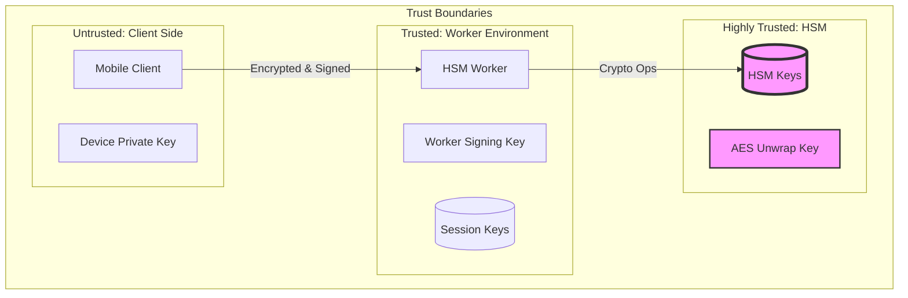
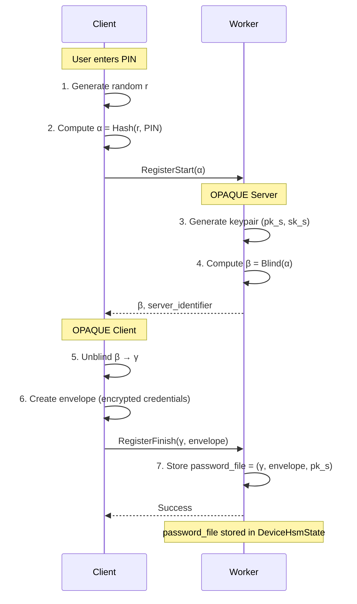
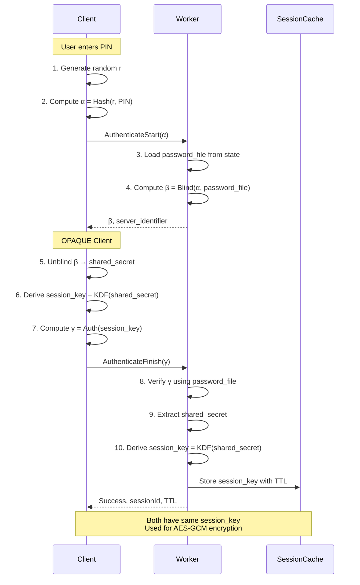
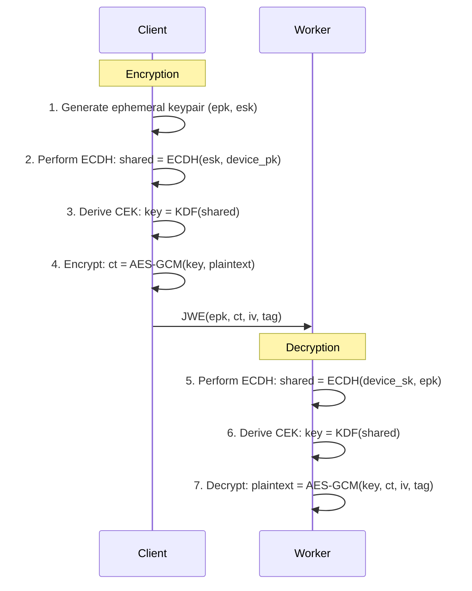
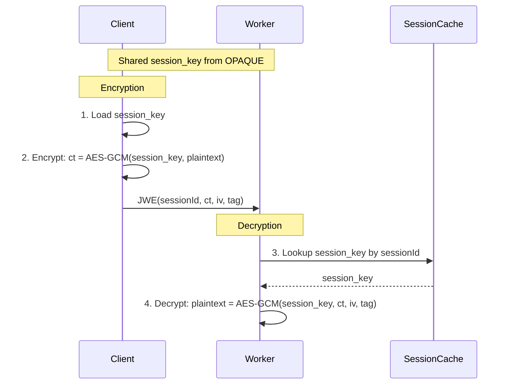
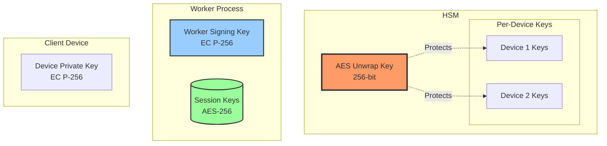

# Security Model

This document explains the security architecture of the HSM Worker, including cryptographic protocols, key management, and threat model.

## Security Architecture



## Security Principles

### Defense in Depth

Multiple security layers protect different aspects:

| Layer | Protection | Mechanism |
|-------|------------|-----------|
| **Transport** | Eavesdropping | TLS (handled by Kafka/Gateway) |
| **Message Integrity** | Tampering | JWS signatures |
| **Message Confidentiality** | Data exposure | JWE encryption |
| **Authentication** | Impersonation | OPAQUE protocol |
| **Authorization** | Unauthorized access | Session validation |
| **Key Protection** | Key theft | HSM hardware protection |

### Zero Trust

- Every request is authenticated (JWS signature verification)
- State is never trusted without signature verification
- Session keys expire and must be refreshed
- HSM operations require valid session

### Least Privilege

- Device keys can only perform operations for that device
- Session keys are ephemeral and short-lived
- HSM keys never leave the HSM
- Worker has minimal access to HSM (only necessary operations)

## Cryptographic Protocols

### OPAQUE (aPAKE)

**OPAQUE** is an asymmetric Password-Authenticated Key Exchange protocol that provides:

- **Password Privacy**: Server never sees the password
- **Pre-computation Resistance**: Offline attacks are infeasible
- **Mutual Authentication**: Both client and server prove identity
- **Forward Secrecy**: Past sessions remain secure even if password is compromised

#### Registration Phase



**Key Properties:**
1. Worker never sees the PIN
2. `password_file` is useless without the correct PIN
3. No offline brute-force attacks (requires online interaction)

#### Authentication Phase



**Security Guarantees:**
- **Mutual Authentication**: Client proves knowledge of PIN, server proves identity
- **Session Key Establishment**: Both derive same `session_key` without transmitting it
- **No Password Exposure**: PIN never transmitted or stored
- **Brute Force Protection**: Failed attempts can be rate-limited

#### OPAQUE Configuration

**Server Setup:**
```rust
pub struct OpaqueConfig {
    // Server long-term state (initialized once)
    pub opaque_server_setup: Option<String>, // Serialized, base64-encoded
    
    // Server identifier (domain name or stable identifier)
    pub opaque_server_identifier: String, // e.g., "signing.example.com"
    
    // Protocol context (prevents cross-protocol attacks)
    pub opaque_context: String, // e.g., "RemoteSigning-v1"
}
```

**Security Notes:**
- `opaque_server_setup` is sensitive and must be protected
- Changing `opaque_server_setup` invalidates all password files
- `opaque_context` binds protocol to specific use case

### JWS (JSON Web Signature)

#### Purpose

JWS provides:
- **Integrity**: Detect tampering
- **Authenticity**: Verify signer identity
- **Non-repudiation**: Signer can't deny signing

#### Usage in the Protocol

| Message | Signed By | Verified By | Purpose |
|---------|-----------|-------------|---------|
| `DeviceHsmState` | Worker | Worker | Prevent state tampering |
| `OuterRequest` | Device | Worker | Prove request from device |
| `OuterResponse` | Worker | Client | Prove response from worker |

#### Signature Algorithm

**ES256** (ECDSA with P-256 and SHA-256)

```
Signature = ECDSA(SHA-256(header || "." || payload), privateKey)
```

**Why ES256?**
- Strong security (128-bit equivalent)
- Compact signatures (~64 bytes)
- Fast verification
- Wide library support

#### JWS Structure

```
header.payload.signature
```

**Example Header:**
```json
{
  "alg": "ES256",
  "kid": "worker-key-2024-01"
}
```

**Verification Process:**
```rust
fn verify_jws(jws: &str, public_key: &EcPublicKey) -> Result<Payload> {
    let (header, payload, signature) = parse_compact_jws(jws)?;
    
    // 1. Decode components
    let header = base64url_decode(header)?;
    let payload = base64url_decode(payload)?;
    let signature = base64url_decode(signature)?;
    
    // 2. Verify signature
    let signing_input = format!("{}.{}", header, payload);
    ecdsa_verify(public_key, signing_input.as_bytes(), &signature)?;
    
    // 3. Return payload
    Ok(payload)
}
```

### JWE (JSON Web Encryption)

#### Purpose

JWE provides:
- **Confidentiality**: Prevent eavesdropping
- **Authenticated Encryption**: Detect tampering of ciphertext

#### Encryption Modes

##### Device Encryption (ECDH-ES)

Used for operations before authentication.

**Algorithm:** ECDH-ES (Ephemeral-Static Elliptic Curve Diffie-Hellman)  
**Encryption:** A256GCM (AES-256-GCM)

**Process:**


**JWE Header:**
```json
{
  "alg": "ECDH-ES",
  "enc": "A256GCM",
  "epk": {
    "kty": "EC",
    "crv": "P-256",
    "x": "...",
    "y": "..."
  }
}
```

**Security Properties:**
- Forward secrecy (ephemeral key pair)
- Each message uses different ephemeral key
- No key wrapping needed (direct key agreement)

##### Session Encryption (Direct AES)

Used for operations after authentication.

**Algorithm:** dir (Direct use of symmetric key)  
**Encryption:** A256GCM (AES-256-GCM)

**Process:**


**JWE Header:**
```json
{
  "alg": "dir",
  "enc": "A256GCM",
  "kid": "session:7c9e6679-7425-40de-944b-e07fc1f90ae7"
}
```

**Advantages:**
- Faster (no ECDH key agreement)
- Smaller messages (no ephemeral public key)
- Proves client authenticated (has session key)

## Key Management

### Key Hierarchy



### Key Types and Properties

#### AES Unwrap Key (HSM)

**Purpose:** Master key for protecting device-specific HSM keys  
**Type:** AES-256 symmetric key  
**Location:** HSM (never exported)  
**Lifetime:** Long-term (years)  
**Usage:** Key wrapping/unwrapping for device keys

**Creation:**
```bash
# One-time initialization
pkcs11-tool --module libsofthsm2.so \
  --login --pin 1234 \
  --keygen --key-type AES:32 \
  --label aes-unwrap-key \
  --id 01
```

**Protection:**
- Stored in HSM only
- Requires HSM PIN for access
- Backed up using HSM-specific secure backup procedures

#### Worker Signing Key

**Purpose:** Sign worker responses and device state  
**Type:** EC P-256 private key  
**Location:** File system (JWK format)  
**Lifetime:** Medium-term (months to years, rotation recommended)  
**Usage:** JWS signatures on `OuterResponse` and `DeviceHsmState`

**JWK Format:**
```json
{
  "kty": "EC",
  "crv": "P-256",
  "x": "...",
  "y": "...",
  "d": "...",  // Private key component
  "use": "sig",
  "kid": "worker-key-2024-01"
}
```

**Protection:**
- File permissions (0600, root-only)
- Encrypted at rest (OS-level disk encryption)
- Regular rotation (e.g., quarterly)

**Key Rotation:**
1. Generate new worker signing key
2. Update configuration
3. Restart worker
4. Old key retained for verification of old states (grace period)

#### Device Private Key

**Purpose:** Sign device requests, decrypt device-encrypted responses  
**Type:** EC P-256 private key  
**Location:** Client device (secure enclave/keystore)  
**Lifetime:** Long-term (lifetime of device registration)  
**Usage:** JWS signatures on `OuterRequest`, JWE decryption (ECDH-ES)

**Protection (Client Responsibility):**
- Secure enclave (iOS Secure Enclave, Android KeyStore)
- Biometric protection
- Hardware-backed if available

#### HSM Device Keys

**Purpose:** Cryptographic operations (signing, ECDH)  
**Type:** EC private keys (P-256, P-384, P-521)  
**Location:** HSM  
**Lifetime:** Variable (per key, user-controlled)  
**Usage:** Application-level signing, key agreement

**Key Label Format:**
```
device:<deviceId>:key:<keyId>
```

Example:
```
device:abc-123:key:signing-key-1
```

**Public Key Tracking:**
Public keys stored in `DeviceHsmState.hsmKeys`:
```json
{
  "hsmKeys": {
    "signing-key-1": {
      "curve": "P-256",
      "publicKey": { "kty": "EC", ... }
    }
  }
}
```

#### Session Keys

**Purpose:** Encrypt session-mode operations  
**Type:** AES-256 symmetric key  
**Location:** Worker memory (session cache)  
**Lifetime:** Short-term (5 minutes default)  
**Usage:** JWE encryption/decryption (dir + A256GCM)

**Derivation:**
```
session_key = KDF(shared_secret_from_OPAQUE)
```

**Cache Properties:**
- In-memory only (not persisted)
- Automatic expiry (TTL-based)
- Per-worker instance (not shared across workers)

### Key Rotation Strategy

| Key | Rotation Frequency | Impact |
|-----|-------------------|--------|
| **Unwrap Key** | Rarely (disaster recovery) | All device keys must be re-wrapped |
| **Worker Signing Key** | Quarterly | Old states unverifiable (plan grace period) |
| **Device Private Key** | Never (per device lifetime) | Device must re-register |
| **HSM Device Keys** | User-controlled | No impact (key-specific) |
| **Session Keys** | Every session (5 min) | Automatic, no action needed |

## Threat Model

### Threats Mitigated

#### 1. Eavesdropping (Passive Network Attacker)

**Threat:** Attacker intercepts Kafka messages or network traffic

**Mitigation:**
- JWE encryption protects sensitive data
- Even with Kafka access, attacker only sees ciphertext
- ECDH-ES provides forward secrecy

**Result:** Confidentiality maintained

#### 2. Message Tampering (Active Network Attacker)

**Threat:** Attacker modifies messages in transit

**Mitigation:**
- JWS signatures detect tampering
- Worker verifies all incoming JWS
- AES-GCM provides authenticated encryption (detects JWE tampering)

**Result:** Integrity maintained

#### 3. Replay Attacks

**Threat:** Attacker captures and replays old valid requests

**Mitigation:**
- Request IDs should be unique (UUIDs recommended)
- State includes version/nonce (future enhancement)
- Session expiry limits replay window

**Result:** Partially mitigated (application should use unique request IDs)

#### 4. Device Impersonation

**Threat:** Attacker tries to impersonate a legitimate device

**Mitigation:**
- `OuterRequest` signed with device private key
- Private key protected in device secure enclave
- Worker verifies signature before processing

**Result:** Prevented (requires stealing device private key)

#### 5. Password Compromise

**Threat:** Attacker learns device PIN/password

**Mitigation:**
- OPAQUE prevents offline brute-force
- PIN never transmitted to worker
- Rate limiting on authentication attempts (application-level)

**Result:** Online attacks rate-limited, offline attacks prevented

#### 6. HSM Key Theft

**Threat:** Attacker tries to extract private keys from HSM

**Mitigation:**
- HSM hardware protection (tamper-resistant)
- Keys never exported in plaintext
- PKCS#11 access controls

**Result:** Prevented by HSM hardware (assuming trusted HSM)

#### 7. Worker Compromise

**Threat:** Attacker gains access to worker process

**Impact:**
- Access to session keys (time-limited)
- Cannot extract HSM keys (HSM protected)
- Cannot impersonate devices (no device private keys)
- Can read current session data

**Mitigation:**
- Principle of least privilege
- Session key expiry limits impact
- HSM separation
- Worker signing key rotation

**Result:** Limited impact, no long-term credential compromise

### Threats Not Mitigated

#### 1. Client-Side Compromise

If attacker compromises the client device:
- Device private key may be stolen
- PIN may be keylogged
- Session keys may be extracted

**Mitigation Strategies:**
- Secure enclave for device key
- Biometric authentication
- Certificate pinning
- Runtime integrity checks

#### 2. HSM Compromise

If HSM itself is compromised (physical access, backdoor):
- All HSM-managed keys exposed

**Mitigation:**
- Use certified HSMs (FIPS 140-2 Level 3+)
- Physical security for HSM
- Regular security audits

#### 3. Side-Channel Attacks

Timing attacks, power analysis, etc., against HSM operations.

**Mitigation:**
- Use constant-time implementations
- HSM firmware resistance
- Limit HSM operation observability

## Security Best Practices

### For Integrators

1. **Protect Device Private Key**
   - Use hardware-backed keystores
   - Never export or log private keys
   - Implement key attestation if available

2. **Implement Rate Limiting**
   - Limit authentication attempts
   - Implement exponential backoff

3. **Validate All Inputs**
   - Verify JWS signatures on all responses
   - Validate `expiresIn` and respect session TTL
   - Check `httpStatus` in responses

4. **Secure Communication**
   - Use TLS for all network traffic
   - Implement certificate pinning
   - Validate server certificates

5. **Session Management**
   - Clear session keys from memory after use
   - Re-authenticate proactively before expiry
   - Handle session expiry gracefully

### For Operators

1. **HSM Security**
   - Use certified HSMs in production
   - Implement physical security
   - Regular firmware updates
   - Backup unwrap key securely

2. **Worker Key Management**
   - Rotate worker signing key regularly
   - Use encrypted storage for keys
   - Implement key ceremony for initial setup

3. **Configuration Security**
   - Protect `opaque_server_setup` (treat as secret)
   - Never log OPAQUE configuration
   - Use environment variables, not config files

4. **Monitoring**
   - Log authentication failures
   - Alert on unusual patterns
   - Track session creation rate
   - Monitor HSM errors

5. **Access Control**
   - Limit who can access HSM PIN
   - Separate duties (operator vs admin)
   - Audit access logs

## Compliance Considerations

### Data Protection

**GDPR Considerations:**
- Device IDs may be personal data (pseudonymous)
- Implement data deletion (delete device keys on request)
- Audit logging for accountability

**PCI DSS (if applicable):**
- HSM for key management (Requirement 3.6)
- Encryption of sensitive data (Requirement 3.4)
- Key rotation and retirement (Requirement 3.6.4)

### Cryptographic Standards

**Algorithms:**
- ECDSA (P-256): NIST FIPS 186-4
- AES-256-GCM: NIST SP 800-38D
- OPAQUE: Draft RFC (CFRG)

**Key Lengths:**
- EC: 256-bit (128-bit security)
- AES: 256-bit
- SHA: SHA-256

**Recommendations:**
- Avoid deprecated algorithms (RSA-1024, SHA-1)
- Plan for post-quantum migration (future)

## Security Audit Checklist

- [ ] HSM certified and physically secured
- [ ] Worker signing key rotated regularly
- [ ] OPAQUE server setup backed up securely
- [ ] Session TTL configured appropriately
- [ ] Rate limiting implemented (application layer)
- [ ] All transport encrypted (TLS)
- [ ] Logging configured (no secrets logged)
- [ ] Access controls in place (HSM PIN, worker keys)
- [ ] Incident response plan documented
- [ ] Regular security testing (penetration tests)

---

This security model provides defense-in-depth protection for the remote signing system, leveraging modern cryptographic protocols, HSM protection, and operational best practices. The architecture is designed to meet eIDAS Level of Assurance (LoA) High requirements by utilizing certified HSMs for cryptographic operations while maintaining usability on standard mobile devices.
